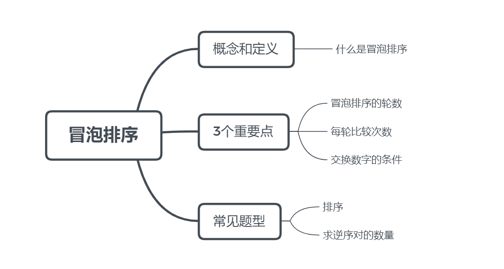
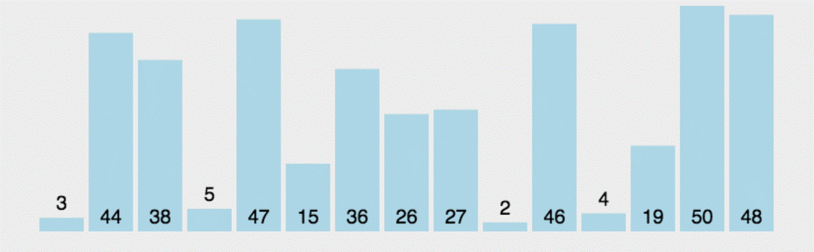

# **隔壁邻居好说话：冒泡排序**

> 各位活泼的运动健将们，有没有喜爱游泳的同学呢？如果你游过泳肯定会有这样的经历：在水里吐泡泡！大家观察过吗，水中的气泡越大，上浮的越快，这是一个神奇的物理现象。如果越大的气泡表示的数值越大，那岂不是可以对所有泡泡，也就是数值排个序，这其实就是我们今天要讨论的冒泡排序，一起往下看吧~
>


## 预习篇

### 1. 还记的之前学过的计数排序吗?

计数排序是依赖**有序的数组下标**进行排序的算法。

回想我们之前做过的经典题目《一个萝卜一个坑》，完成计数排序，我们需要三个步骤：

##### 👣Step **One**  

初始化计数数组，这一步的关键是计数数组的长度，必须使用数组下标，表示每个可能出现的数值，即下标的取值范围要大于等于待排序数值的范围。

##### 👣Step **Two**

```c++
for (int i = 0; i < n; i++) {
	int t;
	scanf("%d", &t);
	cnt[t]++;
}
```

在循环中进行统计，统计每个数字出现的次数。这样一来，出现过的数字 t 对应的 cnt[t] 将会是非零的数， cnt[t] 可是数字 t 出现的次数呢。

##### 👣Step **Three**

根据题目要求，对计数数组的值进行相应的操作。比如最简单的打印，要求出现过的数字：

```c++
for (int i = 0; i <= maxn; i++) {
	if (cnt[i]) printf("%d ", i);
}
```

第三步实际上就是进行扫描。需要注意的是，数组的下标才是数字本身。

- [ ] 太棒了😘，计数排序的知识你还记得。

### 2.如何交换两个元素的值?

如果你有两个杯子，红色杯子 a 装了红墨水，蓝色杯子 b 装了蓝色墨水，请问如何交换他们呢？让红色杯子 a 装了蓝墨水，蓝色杯子 b 装了红色墨水。

有同学会说，直接把红墨水倒在蓝色杯子里，再把蓝色杯子的水倒回来不就好了吗？哈哈哈哈，恭喜你，回答错误，美术课上我们做过实验，红+蓝=紫，那岂不是两种颜色混在一块了。

正确的做法是再拿一个杯子 tmp ，作为中介。

```c++
tmp = a; //把红墨水倒到空杯子中
a = b; //红杯子空了，把蓝墨水倒进去
b = tmp; //蓝杯子空了，最后把tmp杯子的红墨水倒进去
```

- [ ] 哈哈，原来是这样，你学会了吗。

## 课后篇

### 一、这节课我学到了：




#### 1.1 什么是冒泡排序？

**冒泡排序法（Bubble Sort）**是一种相邻数据比较、交换的排序方法，它重复地走访过要排序的元素，依次比较相邻两个元素，如果他们的顺序错误就把他们调换过来，直到没有元素再需要交换，排序完成。

此时，每一轮都能找出一个待排序序列中的最值。



#### 1.2 我们要明确的3个重要点？

⭐轮数：要排序 n 个数，则要进行 n - 1 轮的排序

⭐每轮比较次数：依次比较相邻两个元素，判断是否要交换他们，已经排好序的数字不需要比较和交换

⭐交换数字的条件：根据题目，看好是从小到大排序，还是从大到小排序

#### 1.3身高比较模板题：

##### 题目描述

聪明的小明决定用身高比较的游戏给班上的n名同学从矮到高排队。每轮依然是从左到右，相邻两个位置比较身高，如果左边的同学比右边的高，二人就交换位置。他相信只要重复n-1轮游戏，n名同学就一定能完成从矮到高的排队，请你用程序实现这一过程。

##### 输入描述

输入共两行。第一行一个整数n（不大于100）；第二行为n个正整数，用空格隔开，为游戏开始时从左到右每名同学的身高，以厘米为单位。

##### 输出描述

输出一行，为排队后从左到右每名同学的身高，以空格分隔。

##### 样例输入：

```
5
150 170 155 160 145
```

##### 样例输出：

```
145 150 155 160 170
```

- [ ] 快来试试补完程序

```c++
#include <iostream>
using namespace std;
int main() {
	int n, a[100], tmp;
	cin >> n;
	for (int i = 0; i < n; i++) cin >> a[i];
	for (int i = 0; i < ???; i++)
		for (int j = 0; j < ???; j++)
			if (a[j] ??? a[j + 1]) {
				tmp = a[j];
				???;
				a[j + 1] = tmp;
			}
	for (int i = 0; i < ???; i++) cout << a[i] << " ";
	return 0;
}
```

##### 1.3看看掌握的怎么样，

- [ ] 将n个元素按照从小到大的顺序排序需要多少轮？
- [ ] 一共需要比较多少次？
- [ ] 最多需要交换多少次？
- [ ] 什么时候的交换次数最多？

### 二、课后作业

| 题目*3                                                       |
| ------------------------------------------------------------ |
| [填空题](https://oj.youdao.com/course/10/113/2#/3/8575)      |
| [从大到小排序](https://oj.youdao.com/course/10/113/2#/1/8097) |
| [玩具蛇](https://oj.youdao.com/course/10/113/2#/1/8098)      |

- [ ] 都完成啦！😀😀😀

### 三、更多的练习

这部分练习能够帮助你强化代码能力！就像运动员的力量练习。

| 题目*5                                                      |
| ----------------------------------------------------------- |
| [银行利息](https://oj.youdao.com/course/10/113/2#/1/9184)   |
| [角谷猜想](https://oj.youdao.com/course/10/113/2#/1/9187)   |
| [奖学金](https://oj.youdao.com/course/10/113/2#/1/9094)     |
| [分数线划定](https://oj.youdao.com/course/10/113/2#/1/9088) |
| [单词排序](https://oj.youdao.com/course/10/113/2#/1/9095)   |

- [ ] 你竟然都完成了！！即将变身大牛！！

## 拓展篇

### 冒泡排序的时间复杂度

冒泡排序的时间复杂度是O(n^2)，是稳定的排序。

- [ ] 时间复杂度是指：时间复杂度是一个函数，它定量描述了该算法的运行时间。不急，L3我们才会学到~😘
- [ ] 稳定的排序是指：如果待排序序列中存在相同元素值，排序后相同元素值的相对位置不发生改变的排序。


