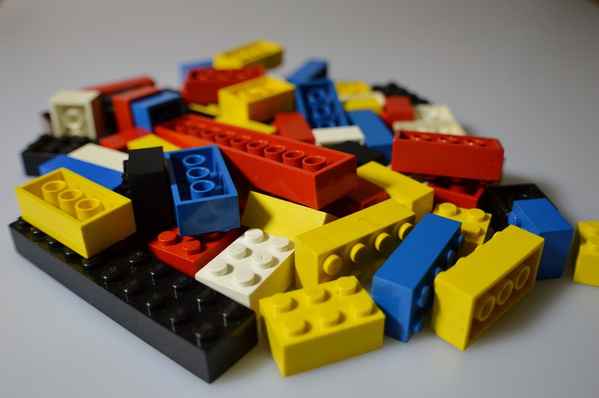
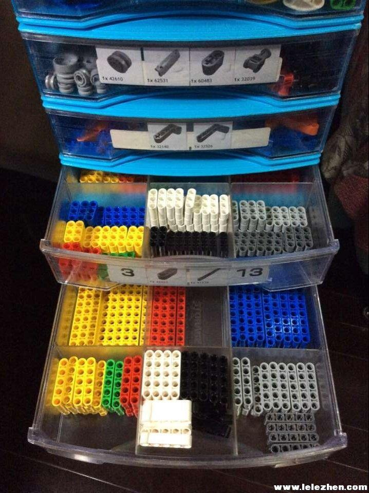
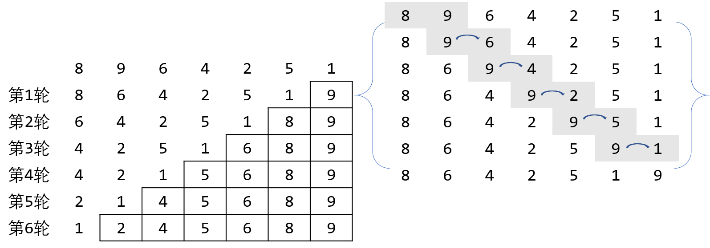
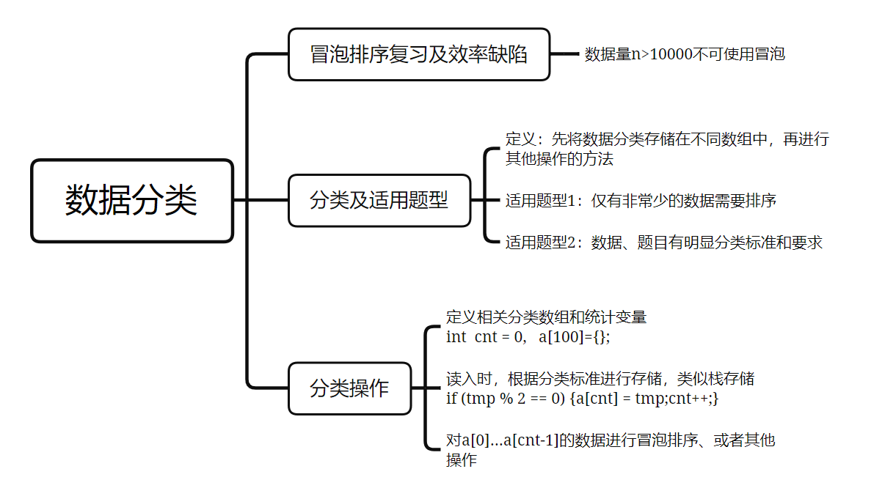

# 数据的巧妙分类：排序+分类存储

> 大家有没有玩过乐高？五颜六色、各种形状的乐高混在一起，给乐高的拼接真是增加了不少麻烦。  
> 这个时候大家一般会如何做呢？

> 是的！分类！当我们把相同颜色、相同形状的乐高积木分门别类的放起来，这样就会很简单。  
> 实际上在编程中，当遇到比较难处理的数据时，分类也是一种常见的方法。  


## 预习篇

### 1. 冒泡排序运行的效率

我们学习过了冒泡排序。大家都已经知道，冒泡排序是一种相邻数据**比较、交换**的排序方法。    
需要**重复、多轮的**访问待排序的元素，依次比较相邻两个元素，如果当前顺序与预期不符，则交换相邻元素。    
每一轮都可以确定一个元素的位置，直到某一轮中不再发生元素交换，则说明该数组已完成排序。  


以下冒泡程序可实现数据从小到大的排序：
```C++
for (int i = 0; i < n - 1; i++)	//i表示轮次
	for (int j = 0; j < n - 1 - i; j++)	//每一轮相邻元素比较，j表示数组下标，优化后，每一轮少比较一次
		if (a[j] > a[j + 1]) swap(a[j], a[j + 1]); //交换函数swap(元素1，元素2)
```

那么现在问题来了，如果要实现最终的排序，最差情况下，以上嵌套循环要执行多少次的比较和交换呢？  
同样我们也知道，信息学比赛中限制程序在1s之内解决问题，1s大约能执行$10^8$次循环。  
那么此时如果有$100,000$个数字要排序，冒泡排序是否能完成任务呢？  

- [ ] 太棒了😘，你读完了预习篇，请你思考冒泡排序**效率**的问题，准备好进入这节课吧！

## 课后篇

### 一、这节课我学到了：




#### 1.1 冒泡排序复习及效率分析

在对冒泡排序的效率分析中，我们知道如果对n个元素进行从小到大的冒泡排序（从左到右遍历），初始序列如果
是从大到小排序的，交换的次数最多。因为**逆序排好**的序列，每次比较都会发生交换，所以是**交换次数最多**的。

举个例子！
以5个数字为例，最差情况下对5 4 3 2 1从小到大排序成1 2 3 4 5的顺序时， 
第一轮需要比较和交换4次变成4 3 2 1 5；    
第二轮需要比较和交换2次变成3 2 1 4 5；    
第三轮需要比较和交换2次变成2 1 3 4 5；  
第四轮需要比较和交换1次变成1 2 3 4 5；  
因此我们一共需要4+3+2+1=10次。  

以10个数字为例，最差情况下，对10 9 8 7 6 5 4 3 2 1从小到大排序，需要比较交换9+8+...+2+1=45次。    
如果有n个数字，由高斯求和公式可知，共需要$n*(n-1)/2$次。
**由此可见，当待排序的数据量增大时，运行的次数会非常快速的增长**。    
当n > 10000时，冒泡排序几乎就无法在1s内完成任务了。


#### 1.2 数据分类的适用题型

当题目有明确的分类标准，比如奇数和偶数、男生和女生、60岁以上或者60岁以下等等，或者说仅有非常少的数据需要排序，
此时都可以先分类，再处理。分类的定义是先将数据分类存储在不同数组中，再进行其他操作的方法。  
对于冒泡排序而言，数据分类可以有效**减少待排序的数据规模**，以提升程序的整体速度。
那么如何分类、并且存储在数组中就成为了我们的首要问题。
其实这里用到的就是之前学习过的栈结构。   


#### 1.3 分类操作
##### 1.3.1 单类别数据分类
我们用**奇数单增**这道课上的题目来分析和复习：    
题目希望我们将n个数字中的奇数，进行从小到大的排序和输出。   
当总的待排序数据n有20000个，全部排序再筛选出奇数会超时；
然而真正需要排序的奇数却只有500个的时候，此时就可以将奇数单独筛选出来进行排序。

以下就是奇数分类、并存储的过程
```C++
int n, odd[505], cnt = 0;
scanf("%d", &n);
for (int i = 1; i <= n;i++){	//此处的i控制循环次数n
	int tmp;
	scanf("%d", &tmp);
	if (tmp % 2 != 0){			//如果是奇数，则存储在a数组		
		odd[cnt] = tmp;			//此处的cnt相当于栈结构中的top，但是需要先存后加
		cnt++;					//存储位置存储在odd[0],odd[1],...,odd[cnt - 1]，一共有cnt个奇数待排序
	}
}
```

接下来就可以对 cnt 个存储在odd[0],odd[1],...,odd[cnt - 1]的奇数进行从小到大的排序啦。
```C++
for (int i = 0; i < cnt - 1;i++)	//此处共重复进行cnt-1轮
	for (int j = 0; j < cnt - i - 1; j++)		//最右边一对要比较的是odd[cnt-2]和odd[cnt-1]
		if (odd[j] > odd[j + 1])swap(odd[j],odd[j+1]);
```

最后输出数据就好啦。

##### 1.3.2 多类别数据分类
当遇到多个类别时，则需要准备两个及以上的数组和统计变量，分别存储和统计即可。

```C++
int n, nm = 0, nf = 0;			//nm记录男生人数，nf记录女生人数
double hm[505], hf[505];		//hm记录男生身高，hf记录女生身高
scanf("%d", &n);
for(int i = 1; i <= n; i++) {
	char ch[7];					//性别female   male
	double tmp;
	scanf("%s %lf", ch, &tmp);
	if(ch[0] == 'm') {			//ch的开头字母是m，就是男生
		hm[nm] = tmp;			//男生身高计入数组
		nm++;					
	} else {					//ch的开头字母不是m，就是女生
		hf[nf] = tmp;			//女生身高计入数组
		nf++;					
	}
}
```
> 注意：ch[0]是单个字符，不可与字符串"m"比较哦，单引号下的'm'才是单个字符！


### 二、3个易错点

接下来请你思考几个易错点，看看是不是你经常出现的错误呢？
#### ❌ One  
将循环变量 i 当成存储下标

```C++
int n, odd[505], cnt = 0;
scanf("%d", &n);
for (int i = 1; i <= n;i++){
	int tmp;
	scanf("%d", &tmp);
	if (tmp % 2 != 0){					
		odd[i] = tmp;		//此处有问题，请思考正确答案
	}
}
```

**分析如下：**

若输入为
```C++
10 
1 3 2 6 5 4 9 8 7 10
```
此时会将奇数存到第i位，偶数不存保持初始0，结果odd数组会变成：
```C++
1 3 0 0 5 0 9 0 7 0
```
对上述数据排序后，既没有达到减少数据量的效果，也会把0排序到最前边，相当于做了无用功。


#### ❌ Two  
分类时，先cnt++，再存储

```C++
int n, odd[505], cnt = 0;
scanf("%d", &n);
for (int i = 1; i <= n;i++){
	int tmp;
	scanf("%d", &tmp);
	if (tmp % 2 != 0){	
		cnt++;				//此处有问题，请思考正确答案
		odd[cnt] = tmp;		
	}
}
```

**分析如下：**

先cnt++再存储，存储位置将改变为a[1],a[2],...,a[cnt]。而我们学习的冒泡排序模板，
需要待排序数据存储在a[0]...a[cnt-1]，存储位置不匹配也不可以哦！

> 拓展：

当然如果可以将冒泡排序内层循环变量 j 的起始位置向后挪一下，就可以啦！


#### ❌ Three
筛选出来的数据是 cnt 个，但是却将总数据量 n 当作冒泡排序的循环依据，或者把其他分类的统计变量混用

```C++
for (int i = 0; i < n - 1;i++)				//此处有问题，请思考正确答案
	for (int j = 0; j < n - i - 1; j++)		//此处有问题，请思考正确答案
		if (odd[j] > odd[j + 1])swap(odd[j],odd[j+1]);
```

**分析如下：**

大多数情况下cnt < n，此时对odd数组排序会把很多无关的数据放进来。


### 三、课后作业

| 题目*2                                                      |
| ------------------------------------------------------------ |
| [编程题1](https://oj.youdao.com/course/10/115/2#/1/8106)      |
| [编程题2](https://oj.youdao.com/course/10/115/2#/1/8107)      |

- [ ] 都完成啦！😀😀😀

### 四、更多的练习

这部分练习能够帮助你强化代码能力！就像运动员的力量练习。

| 题目*4                                                       |
| ------------------------------------------------------------ |
| [药房管理-栈的思想](https://oj.youdao.com/problem/9189?from=problems) |
| [数字黑洞-数位拆分+排序](https://oj.youdao.com/problem/9368?from=problems) |

哇！这些你都完成了，恐怖如斯~
