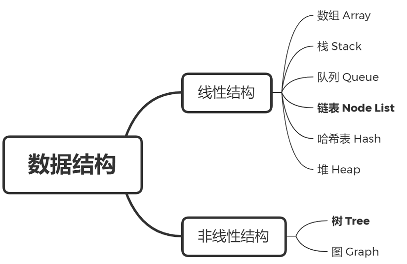
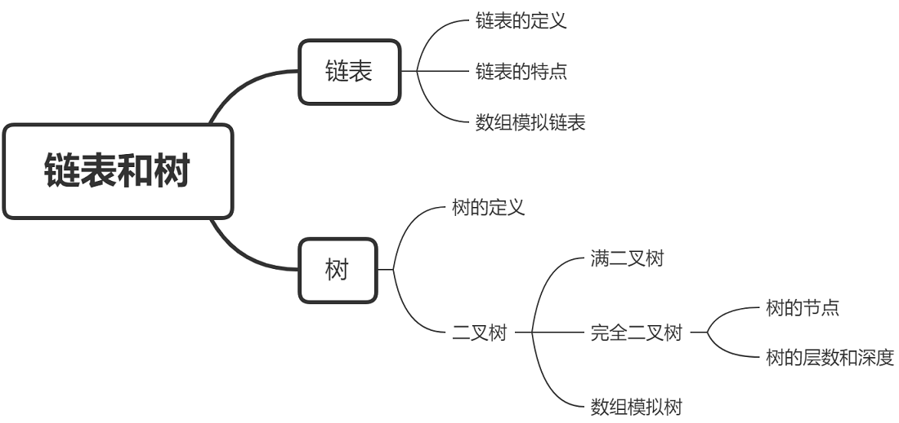
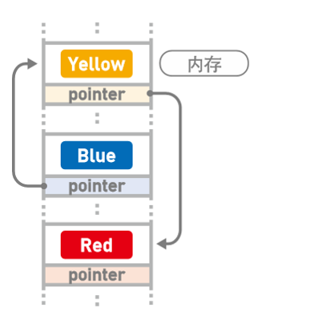
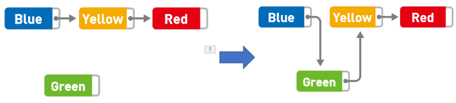
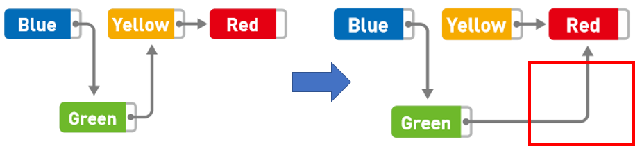
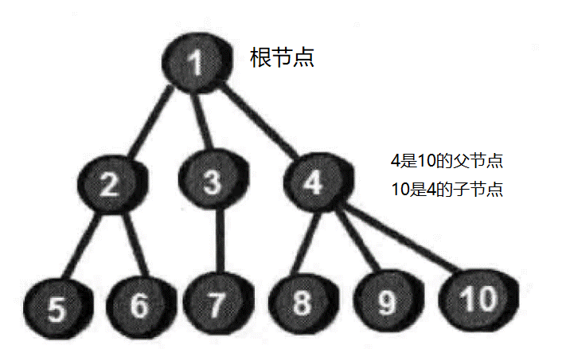
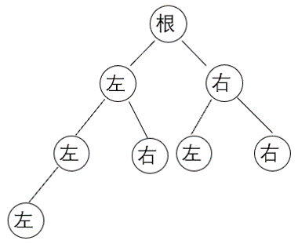
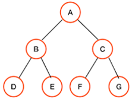

# 给数据建个家谱：链表和树

> *大富翁的游戏大家应该都玩过，玩家出生在地图上的任意位置，通过摇色子确定前进的步数，到达指定的地点完成指定的任务。*
>
> *不过，任务目标并不是连续的，如果分散在数组当中来保存，需要开辟许多空的数组空间来保存，造成资源的浪费。*
>
> *数组仅仅可以保存元素的值，如果我还想保存下一个元素的位置，有没有其他更合适的数据结构呢？*
>
> 

## 预习篇

### 1.什么是数据结构

数据结构(Data Structure)是计算机存储、组织数据的方式。像我们之前学过的数组，栈和队列就是常见的数据结构。

数据结构分为线性结构和非线性结构。

#### 1.1线性结构

线性结构就是表中各个结点具有线性关系。线性结构有且仅有一个开始结点和一个终端结点，所有结点都最多只有一个直接前驱结点和一个直接后继结点。

数组和线性表就是典型的线性结构。

#### 1.2非线性结构

非线性结构就是表中各个结点之间具有多个对应关系。非线性结构的一个结点可能有多个直接前驱结点和多个直接后继结点。

树和图是典型的非线性结构。




- [ ] 太棒了😘，你读完了预习篇，了解了线性结构和非线性结构的概念。

## 复习篇



### 1.链表

链表不仅要存储每个元素，同时还存储该元素的下一个元素的位置信息，从而使一系列随机存放的数据串在一起。


链表存储数据时无需存储在连续空间内，但是查询数据必须从第一个数据开始。它的特点是插入与删除数据十分方便，但寻找与读取数据的表现欠佳。



链表能方便地删除、插入数据，操作次数是$O(1)$。寻找、读取数据的效率不如数组高，在随机访问数据中的操作次数是 $O(n)$。

数组可以方便地寻找并读取数据，在随机访问中操作次数是$O(1)$。但删除、插入的操作次数是$O(n)$次。

### 2.数组模拟链表

链表增加数组的操作如下：只需要让Blue指向Green，再让Green指向Yellow。



原始代码为

```c++
nxt[blue] = yellow;
nxt[yellow] = red;
```

增加元素的操作可参考代码

```c++
nxt[blue] = green;
nxt[green] = yellow;
```

链表删除数组的操作如下：只需要让Green指向Red，无需从内存中清除Yellow。



原始代码为

```c++
nxt[blue] = green;
nxt[green] = yellow;
```

删除元素的操作可参考代码

```c++
nxt[green] = yellow;
```

### 3.链表练习

- [ ] [初赛中考察链表的选择题](https://oj.youdao.com/course/10/117/1#/3/8587)

- [ ] [数组模拟链表编程题](https://oj.youdao.com/course/10/117/1#/1/8115)

编程题参考代码

```c++
#include <bits/stdc++.h>
using namespace std;
int a[10005], nxt[10005];
int main(){
    int n, m;
    cin >> n >> m;
    // 建立链表
    for (int i = 1; i <= n; i++){
        cin >> a[i];
        nxt[i] = i + 1;
    }
    nxt[0] = 1;
    nxt[n] = -1;
    // 删除元素
    for (int i = 0; i < m; i++){
        int b;
        cin >> b;
        for (int j = 0; j != -1; j = nxt[j]){
            // nxt[j]下一个位置，a[nxt[j]]下一个位置的值
            if (a[nxt[j]] == b){
                nxt[j] = nxt[nxt[j]];
                break;
            }
        }
    }
    // 输出
    for (int j = nxt[0]; j != -1; j = nxt[j]){
        cout << a[j] << ' ';
    }
    return 0;
}
```

------


### 4.树基本概念

树的每个元素只有一个先驱，但可能有多个后继。树中的每个点称为结点，一棵树有且只有一个根结点。根结点有时也称为祖先。

父节点：一个结点到根节点的路径上最近的一个节点成为该节点的父节点，反之则成为子节点，根节点没有父节点。

叶子节点：如果一个结点没有子结点，那么我们称这个结点为叶子结点。5~10号结点都是叶子结点。

树的深度：根为第一层，其他结点的层次为父结点的层次数加1，树中结点的最大层次数为树的深度。



### 5.二叉树

二叉树的特点是每个结点最多有两个孩子，左边的叫作左孩子，右边的叫作右孩子。



满二叉树：在一棵二叉树中，如果所有分支结点都存在左子树和右子树，并且所有叶子结点都在同一层上，这样的一棵二叉树称之为满二叉树。

重要性质：在同样深度的二叉树中，满二叉树的结点个数最多，叶子结点个数最多



完全二叉树：对一棵树中的结点按从上至下、从左至右的顺序进行编号，如果每个节点的编号都与该位置在满二叉树中的编号相同，则称该树为完全二叉树。

重要性质：最下层若有叶子结点，一定集中在左侧。倒数第二层若有叶子结点，一定集中在右侧。


### 7.树练习

- [ ] [二叉树性质选择题](https://oj.youdao.com/course/10/117/1#/3/8590)
- [ ] [二叉树性质选择题](https://oj.youdao.com/course/10/117/1#/3/8592)
- [ ] [数组模拟二叉树填空题](https://oj.youdao.com/course/10/117/1#/3/8593)
- [ ] [数组模拟二叉树编程题](https://oj.youdao.com/course/10/117/1#/1/8116)

编程题参考代码

```c++
#include <bits/stdc++.h>
using namespace std;
int node[26]; // node[i]表示结点i所在的下标
int main(){
    int n, maxn = -1;
    cin >> n;
    // l和r分别表示左儿子和右儿子，g表示根节点
    for (int i = 0; i < n; i++){
        char g, l, r;
        cin >> g >> l >> r;
        if (i == 0) node[g-'a'] = 1;
        if (l != '*') node[l-'a'] = node[g-'a'] * 2;
        if (r != '*') node[r-'a'] = node[g-'a'] * 2 + 1;
    }
    for (int i = 0; i < 26; i++){
        if (node[i] > maxn) maxn = node[i];
    }
    cout << maxn;
    return 0;
}
```

------

## 课后作业

[链表选择题](https://oj.youdao.com/course/10/117/2#/3/8594)

[二叉树选择题](https://oj.youdao.com/course/10/117/2#/3/8595)

[二叉树选择题](https://oj.youdao.com/course/10/117/2#/3/8596)

[初赛中链表的阅读理解](https://oj.youdao.com/course/10/117/2#/3/8597)