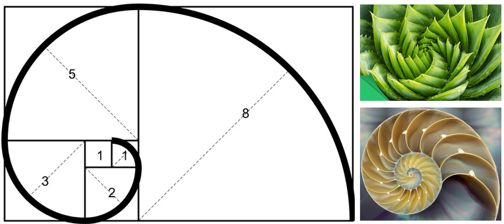
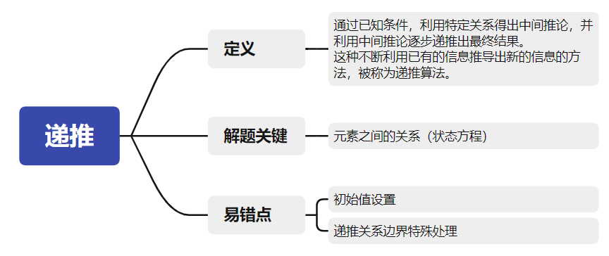

# 步步为营找规律：递推

> 什么是递推？
>
> 递推就是从第一个数字按照特定的公式一步一步计算出后面所有数字的过程。



## 预习篇

### 1. 请观察下面这些数字有什么特点并写出第10个数字应该是多少？

> 1、1、2、3、5、8、13、...

那么按照这个规律，这个数列第10个数字为______________________________．

### 2. 斐波那契数列（Fibonacci sequence）

> 斐波那契数列（Fibonacci sequence），又称黄金分割数列，因数学家莱昂纳多·斐波那契（Leonardo Fibonacci）以兔子繁殖为例子而引入，故又称为“兔子数列”，指的是这样一个数列：1、1、2、3、5、8、13、21、34、……

斐波那契数列的递推公式为：
$$
\left\{\begin{matrix} 
  a_n=1(n=1或n=2) \\  
  a_n=a_{n-1}+a_{n-2}(n\ge 3) 
\end{matrix}\right.
$$
它的第1项和第2项是均为1，从第3项开始，每一项等于前面2项的和。由于他在某些条件下符合黄金分割比列，所以也被称为黄金分割数列。

生活中有很多符合斐波那契数列的实例，你能在下面这个视频中找到几个呢？

[视频1](https://www.bilibili.com/video/BV1Lt4y127bY/?spm_id_from=333.1007.top_right_bar_window_history.content.click&vd_source=b47bbd247434582a855e87646105f75c)


## 课后篇

### 一、这节课我学到了：




#### 1.1. 什么是递推？

通过已知条件，利用特定关系得出中间推论，并利用中间推论逐步递推出最终结果。

这种不断利用已有的信息推导出新的信息的方法，被称为递推算法。

解题关键在于：递推关系的寻找，要注意边界值的递推公式可能会有所变化。


#### 1.2. 模板 取数问题

##### 题目描述

小刘的叔叔新开了一家养殖场，准备引入一种宠物兔子进行养殖，如果一对兔子每月能生一对小兔子，而每对小兔子从它们出生后的第3个月起，又能开始生一对小兔子，假定在不发生死亡的情况下，由一对刚出生的小兔子开始，第$n$个月养殖场有多少对兔子？

请将程序补充完整。


##### **输入**

输入1行，包含1个正整数$n$（$1\le n\le40$）


##### **输出**

输出1行，假定不发生死亡的情况下，由一对刚出生的小兔子开始，输出$n$个月后有多少对兔子。


##### 样例输入：

```
8
```


##### 样例输出：

```
21
```


- [ ] ##### 快来试试补完程序


```c++
//尝试填空
#include <bits/stdc++.h>
using namespace std;

int main(){
    //第1步：初始化数组
    int a[???] = {???};
    
    //第2步：根据递推关系计算
    for(int i = ???;i <= ???;i++){
        a[i] = ???;
    }
    
    //第3步：根据需求输出
    int n;
    cin >> n;
    cout << ???;
    return 0;
}
```

#### **1.3. 解题关键**

#####  “递推法”解题首先要分析归纳出“递推关系”

解决递推问题有三个重点：
1、建立正确的递推关系式；
2、分析递推关系式的边界值；
3、根据递推关系式编程求解。
递推法分为“顺推”和“倒推”两类模型：
1、顺推，就是从问题的边界值出发，通过递推关系式依次从前往后递推出问题的解；
2、倒推，就是在不知道问题的边界值，从问题的最终解(目标状态或某个中间状态)出发，反过来推导问题的初始状态。
递推的思路比较灵活，在找不到思路的时候可以暴力计算简单情况后观察规律。


#### **1.4. 两个易错点**

##### ❌ One

数组不进行初始化。

比如斐波那契数列的递推公式：$a[i] = a[i - 1] + a[i - 2]$；

如果不知道$a[1]$和$a[2]$，递推计算就无法开始。

初学就容易写错为

```c++
// 下面是错误的示例！

	int a[40];
    for(int i = 3;i <= 40;i++){
    	a[i] = a[i - 1] + a[i - 2];
    }

//这个写法的错误在数组没有初始化，这样的话在计算的过程中无法正确递推。

//正确示例
	int a[40] = {0, 1, 1};
    for(int i = 3;i <= 40;i++){
    	a[i] = a[i - 1] + a[i - 2];
    }
```


##### ❌ Two

边界值递推公式可能有变化。

有同学喜欢用if语句单独输出斐波那契数列的第1项和第2项，但是在写的时候容易忘记。

```c++
//常见for循环写错的示例
	int a[40] = {};
    for(int i = 1;i <= 40;i++){
    	a[i] = a[i - 1] + a[i - 2];
    }
//循环从第一项开始计算，但是未做初始化同时没有单独处理n为1和2。
	int a[40] = {};
    for(int i = 1;i <= 40;i++){
        if(n == 1 || n == 2) a[i] = 1;
        else a[i] = a[i - 1] + a[i - 2];
    }
//这里举了一个比较简单的例子，有些题目当中边界值的公式会完全不同，一定要单独分类思考。
```


### 二、课后作业

| 题目 * 3                                                     |      |
| :----------------------------------------------------------- | ---: |
| [输出亲朋字符串](https://oj.youdao.com/course/10/119/2#/1/8126) |      |
| [同行列对角线的格子](https://oj.youdao.com/course/10/119/2#/1/9053) |      |
| [求分数序列和](https://oj.youdao.com/course/10/119/2#/1/9197) |      |

- [ ] 都完成啦！😀😀😀


### 三、真题重现


#### 3.1  选择题 [2021普及组初赛第13题改编]

考虑如下递推算法伪代码，则计算$n=7$得到的结果为（     ）。

```
1	solve(n)
2		if n <= 1 solve(n) = 1
3		else if n >= 5 solve(n) = n * solve(n - 2)
4		else solve(n) = n * solve(n - 1)
```

A.105			B.840			C.210			D.420

#### 3.2  填空题 [2014普及组初赛第24题改编]

考虑如下递推算法伪代码，则计算输入7得到的结果为（     ）。

```
1 fun(n)  
2     if(n == 1)        
3         fun(n) = 1;      
4     esle if(n == 2)        
5         fun(n) = 2;  
6     else fun(n) = fun(n - 2) - fun(n - 1);    
```

A.105			B.840			C.210			D.420


### 四、挑战题目

| 题目                                                         |      |
| :----------------------------------------------------------- | ---: |
| [计算多项式的导函数](https://oj.youdao.com/problem/9207?from=problems) |      |
| [Pell数列](https://oj.youdao.com/problem/9228?from=problems) |      |
| [平面分割](https://oj.youdao.com/problem/547?from=problems)  |      |

- [ ] 挑战题也都完成啦！强的如同👽！


