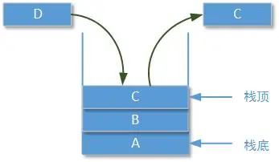
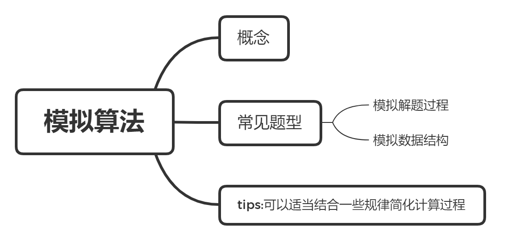
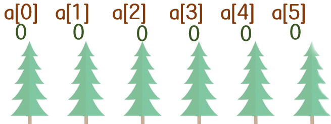
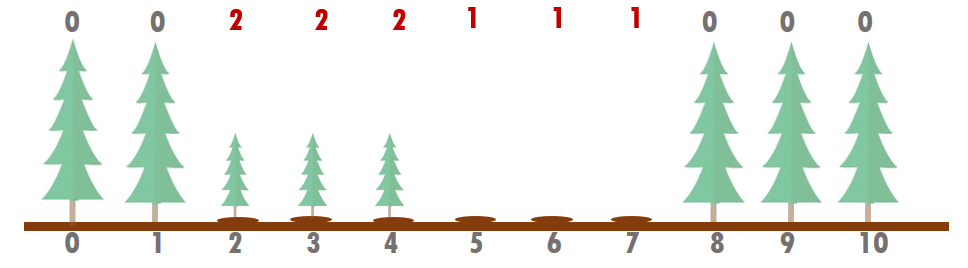

# 制作你的游戏规则：模拟算法

> 什么是模拟算法？
>
> 现实生活中有些问题难以找到公式或规律来求解，只能按照一定的步骤不停地模拟下去，最后才能得到答案。这样的问题，用计算机求解十分合适，只要能让计算机模拟人在解决此问题时的行为即可。这种求解问题的思想，称为**模拟** 。
>
> 模拟算法，用一句老话说，就是“照着葫芦画瓢”。
>
> tips:在解决模拟类问题时，需要注意字符串处理、特殊情况处理和对题目意思的理解以及数据范围的考虑。简单点说就是仔细读题、仔细读题、仔细读题（重要的事情说三遍）。
>


## 预习篇

### 1. 举例感受一下“模拟”

​        某监狱里有个很长的走廊，走廊中一个接一个地有n（n ≤ 10000）个房间。每个房间中锁着一个犯人。一天夜里，狱警决定玩一个无聊的游戏。第一轮中，他喝了一口威士忌，然后打开每个房间。第2轮，他喝了一口威士忌，然后按2的倍数遍历每个房间。第3轮，他又喝了一口威士忌，遍历所有3的倍数的房间，以此类推。在遍历中，如果房间是锁着的，则打开；否则锁上。他这样重复n轮，最后醉酒。这时有些囚犯看到自己的房间所被打开了，他们立即逃跑。对于有n个房间的走廊，最终会有多少个囚犯逃脱？

**分析：**整个问题没有什么固定的规律和公式，只需使用一个数组模拟每一个房间的状态。然后按照题意要求第i轮将i的倍数的房间改变状态，最后统计一下被改变的房间数量即可。

- [ ] ##### 快来试试补完程序

```c++
#include <iostream>
using namespace std;
int n, a[105];
int main() {
	cin >> n;
	for(int i = 1; i <= n; i ++) {
		for(int j = 1; j <= n; j ++) {
			if(???) a[j] = 1;
		}
	}
	int cnt = 0;
	for(int i = 1; i <= n; i ++) 
		if(???) cnt ++;
	cout << cnt;
	return 0;
}
```


### 2. 温故而知新：模拟数据结构

​		有的时候模拟并不一定都是模拟解题过程，有的时候也会模拟合适的数据结构。比如Unit2作业题当中有一道题—《给定指令模拟进出栈》。



根据题目要求模拟进栈和出栈的过程，直到n个元素全部进栈，当想要再执行进栈操作但是已经没有待进栈的元素了，倒序输出栈里的所有元素。

动手做：

- [ ] [**给定指令模拟进出栈**](https://oj.youdao.com/problem/8142?from=problems)

## 课后篇

### 一、这节课我学到了：




#### 1.1. 真题再现： 校门外的树


##### 题目描述

某校大门外长度为L的马路上有一排树，每两棵相邻的树之间的间隔都是1米。我们可以把马路看成一个数轴，马路的一端在数轴0的位置，另一端在L的位置；数轴上的每个整数点，即0，1，2，...，L，都种有一棵树。
由于马路上有一些区域要用来建地铁。这些区域用它们在数轴上的起始点和终止点表示。已知任一区域的起始点和终止点的坐标都是整数，区域之间可能有重合的部分。现在要把这些区域中的树（包括区域端点处的两棵树）移走。

你的任务是计算将这些树都移走后，马路上还有多少棵树。

##### **输入**

每组输入数据的第一行有两个整数L（1<=L<=10000）和M（1<=M<=100），L代表马路的长度，M代表区域的数目，L和M之间用一个空格隔开。接下来的M行每行包含两个不同的整数，用一个空格隔开，表示一个区域的起始点和终止点的坐标。

##### **输出**

每组输出包括一行，这一行只包含一个整数，表示马路上剩余的树的数目。


##### 样例输入：

```
500 3
150 300
100 200
470 471
```


##### 样例输出：

```
298
```


- [ ] ##### 快来试试补完程序


```c++
//尝试填空
#include <iostream>
using namespace std;
int a[10005] = {}; // 默认所有位置都是有树的
int main(){
    int L, m, x, y;
    cin >> L >> m;
    while(m --){
        cin >> x >> y; //把当前输入的区域内树木全部移走
        for(int i = x; i <= y; i ++) a[i] = ？？？;//表示没有树了
    }
    //求剩下了多少棵树
    int cnt = 0;
    for(int i = ？？？; i <= ？？？; i ++)
        if(a[i] == ？？？) cnt ++; //统计还剩下多少棵树
    cout << cnt;
    return 0;
}

```

#### **1.2. 模拟算法一般用法**

模拟算法不是某种固定的算法，而是一种算法思想。就是按照题意一步一步执行下去，从而得到结论。本节课例题讲解了模拟状态和模拟过程。

##### 1.2.1 模拟状态

在校门外的树例题中，求解方法就是使用数组将所有a[i]打上标记0，表示这个点有树。然后在执行过程，需要移走树木的位置更改标记为1，表示没有树。这就是典型的模拟状态。




##### 例题2：题目描述

某校大门外长度为L的马路上有一排树，每两棵相邻的树之间的间隔都是1米。我们可以把马路看成一个数轴，马路的一端在数轴0的位置，另一端在L的位置；数轴上的每个整数点，即0，1，2，...，L，都种有一棵树。

有一个砍树者，会砍掉某个区域内的每一棵树，（记作 0 10 20，其中0表示砍树者，10 20表示砍掉10~20范围内的所有树，含两端）。

幸运的是，有一个植树者，在某一区域内，凡是有空穴（树被砍且还没种上树苗或树苗又被砍掉），他会补种上树苗。（记作 1 5 10，其中1表示植树者，5 10表示在5~10范围的空穴处种树苗，含两端）。

问：最终校门外留下的**树苗**多少棵？

植树者种上又被**砍掉的树苗**有多少棵？  

##### **输入**

第一行输入整数L、整数N，表示校园外原来有L+1棵树，并有N次砍树或种树的操作。

以下N行，输入砍树或植树的标记、范围区间，每行3个整数。

其中：L（1 <= L <= 10000）和 N（1 <= N <= 100）   

##### **输出**

第1行校门外留下的树苗数目，

第2行种上又被拔掉的树苗数目。

##### 样例输入：

```
10 3
0 2 6
1 1 8
0 5 7
```

##### 样例输出：

```
3
2
```

**分析：**用数组记录这段路上树木的状态，trees[位置] = 0树 / 1坑 / 2苗 



- [ ] ##### 快来试试补完程序

```c++
//尝试补全程序
#include <iostream>
using namespace std;
int a[10005] = {}; //0有树 1坑 2树苗
int main(){
    int L, n, op, x, y;
    int movetree = 0, keep = 0;// cnt1表示有多少树苗被砍掉了  cnt2表示剩下树苗数量
    
    cin >> L >> n;
    while(n --){
        cin >> op >> x >> y;
        if(op == 0){
            for(int i = x; i <= y; i ++){
                if(a[i] == ？？？) movetree ++;
                a[i] = ？？？;
            }
        }else {
            //种树
            for(int i = x; i <= y; i ++){
                if(a[i] == ？？？) a[i] = ？？？;  //如果是坑才能种上一棵树苗
            }
        }
    }
    for(int i = 0; i <= L; i ++){
        if(a[i] == ？？？) keep ++;
    }
    cout << keep << '\n' << movetree;
    return 0;
}
```


##### 1.2.2 模拟过程

例题1校门外的树中移除树的过程以及例题2中移走树和种树苗的过程。

```c++
cin >> x >> y; //把当前输入的区域内树木全部移走
for(int i = x; i <= y; i ++) a[i] = 1;//1表示没有树
```

##### 例题：题目描述

n个人站成 一排 玩一个报数游戏。所有人从左到右编号为1到n。

游戏开始时，最左边的人报1，他右边的人报2，编号为3的人报3，等等。当编号为n的人（即最右边的人）报完n之后，轮到他左边的人（即编号为n-1的人）报n+1，然后编号为n-2的人报n+2，以此类推。当最左边的人再次报数之后，报数方向又变成从左到右，依次类推。 

为了防止游戏太无聊，报数时有一个特例：如果应该报的数包含数字7或者是7的倍数，他应当用拍手代替报数。

给定n，m和k，计算当编号为m的人第k次拍手时，他实际上数到了几。

##### **输入**

输入一行，包含三个整数n，m和k（2<=n<=100,1<=m<=n, 1<=k<=100）。

##### **输出**

输出一行，即编号为m的人第k次拍手时，他实际上数到的那个整数。


##### 样例输入：

```
4 3 1
```


##### 样例输出：

```
7
```

**分析：**这道题是典型的一道模拟过程题目，模拟数数的过程，只要数到**包含数字7或者是7的倍数**就拍手一次，直到模拟到编号为m的人第k次拍手为止。

- [ ] ##### 快来试试补完程序


```c++
#include <iostream>
using namespace std;
bool is7(int n){
    if(n % 7 == 0) return true;
    while(n){
        if(n % 10 == 7) return true;
        n /= 10;
    }
    return false;
}
int main(){
    int n, m, k;
    cin >> n >> m >> k; //n个人玩游戏  第m个人  拍手k次的时候数的数字是哪个
    int clap = 0, code = 1; //拍手的次数以及数数的人是谁
    for(int i = 1;  ; i ++){
        if(code == ？？？) code = 1;
        if(is7(i) && code == ？？？) clap ++;
        if(clap == ？？？){
            cout << i;
            break;
        }
        code ++;
    }
    return 0;
}
```

#### 1.3. 适当寻找一些规律，减少运算

模拟算法题目也不一定都是毫无规律，直接模拟状态或者过程。我们在数7玩的游戏中发现编号为m的人数的第一个数字是m，之后的每一个数字相较于前一个数字增加n。所以既然找到了编号m的数数规律，那么就可以只针对编号m所数的数字进行讨论。


```c++
for(int i = m;  ; i += n){ // m  m+n  m+2*n  m+3*n  ...
    if(is7(i)) clap ++;
    if(clap == k){
        cout << i;
        break;
    }
}  
```


### 二、课后作业

| 题目 * 3                                                  |      |
| :-------------------------------------------------------- | ---: |
| [选择](https://oj.youdao.com/course/10/120/2#/3/8602)     |      |
| [交换小球](https://oj.youdao.com/course/10/120/2#/1/8132) |      |
| [大环保家](https://oj.youdao.com/course/10/120/2#/1/8133) |      |

- [ ] 都完成啦！😀😀😀


### 三、挑战题目

| 题目                                                         |      |
| :----------------------------------------------------------- | ---: |
| [细菌繁殖](https://oj.youdao.com/problem/9061?from=problems) |      |
| [连续出现的字符](https://oj.youdao.com/problem/9081?from=problems) |      |
| [多项式输出](https://oj.youdao.com/problem/9252?from=problems) |      |
| [学做菜](https://oj.youdao.com/problem/9372?from=problems)   |      |

- [ ] 挑战题也都完成啦！强的如同👽！


