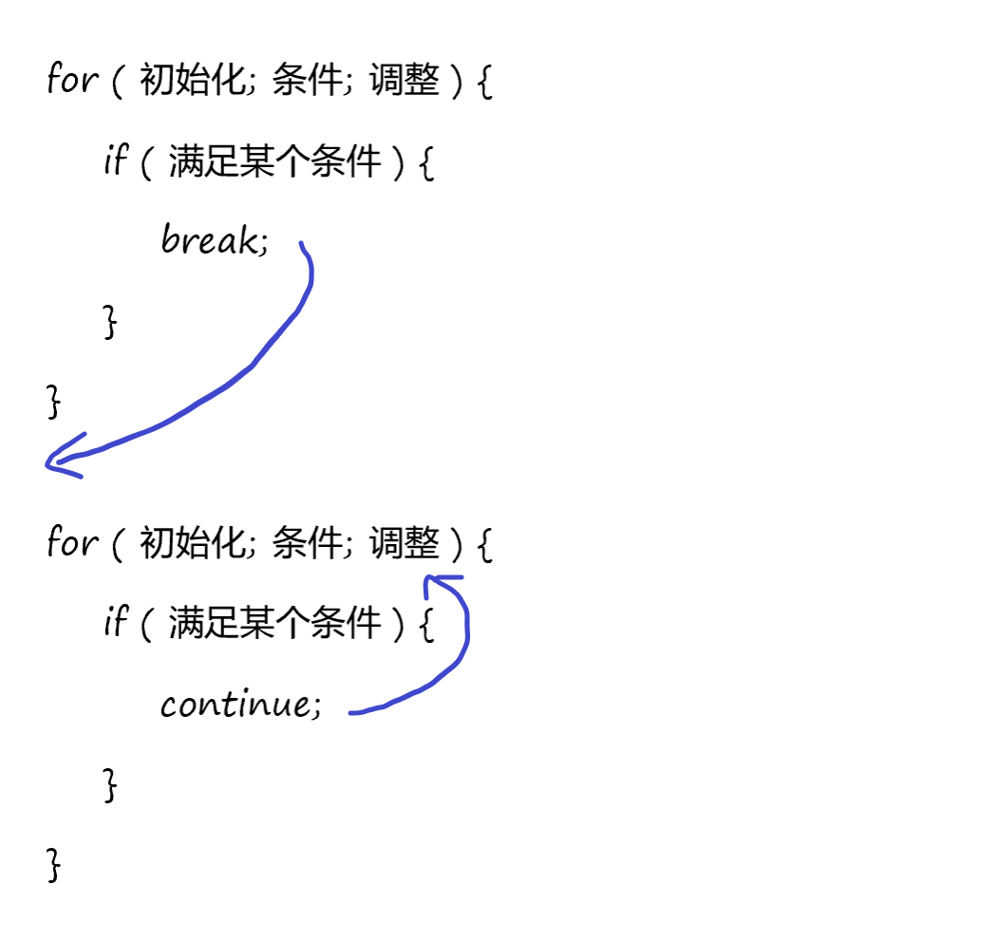
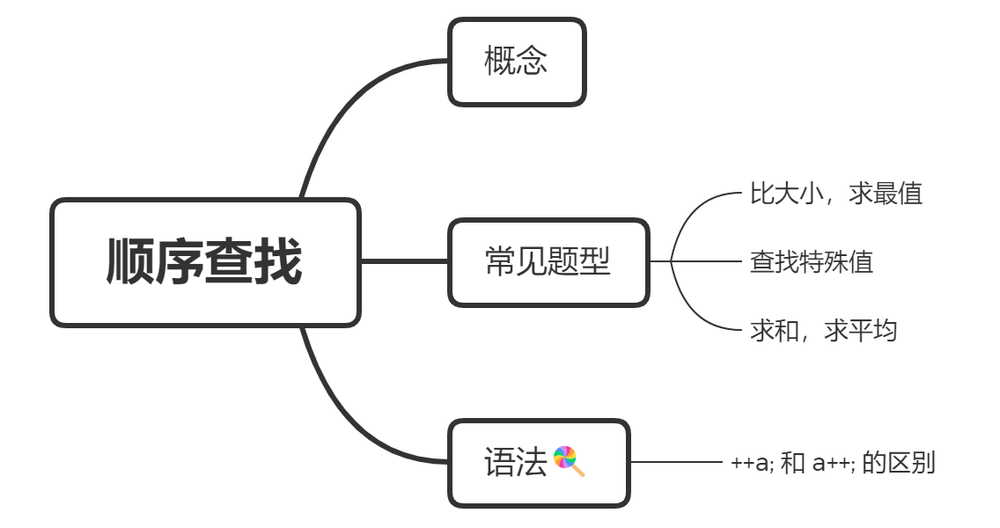
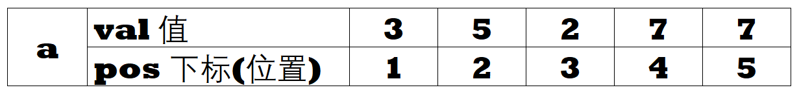

# 众里寻他千百度：顺序查找

> 什么是查找？
>
> 查找就是每天早上翻箱倒柜想找出符合心情的那件衣裳的过程。
>
> 计算机中的查找指根据指定条件找到数据元素的过程。能够找到满足条件的元素表示查找成功，反之表示查找失败。


## 预习篇

### 1. 循环语句 for 的基本用法

for (循环变量初始化；循环的运行条件；循环变量的变化) {

​    每次循环中要做的事情；

}

举个栗子：

```c++
//代码片段：从 1 打印到 100，输出中间用空格分隔

for (int i = 1; i <= 100; i++) {
    printf("%d ", i);
}
```

有些情境下，还需要在for语句中嵌套其他语句：

```C++
//代码片段： 打印 1 到 100 中 所有能被 7 整除的数字，空格分隔
for (int i = 1; i <= 100; i++) {
    if (i % 7 == 0) {
        printf("%d ", i);
    }
}
```

动手做：

- [ ] [**奇数求和**](https://oj.youdao.com/problem/9182?from=problems)


### 2. continue 和 break 的基本用法

break 和 continue 像一对兄弟👯‍♂️，很容易混淆。和循环语句配合使用时，break的作用是跳出循环，continue的作用是跳过本次循环。



如上图所示，当程序运行了break语句，那么下一句就会运行 for循环外的语句，而当程序运行了continue 就会运行循环变量的变化语句。

动手做：

- [ ] [**判断素数**](https://oj.youdao.com/problem/793?from=problems)

## 课后篇

### 一、这节课我学到了：




#### 1.1. 什么是顺序查找？

顺序查找（sequential search）是一种简单好用的查找方式。对于像数组、栈、队列、链表这些线性数据结构，使用顺序查找，意味着从一端开始对每个元素进行依次比较，若找到则返回相应的信息（一般是下标），否则返回特定的值，表示查找失败。

很多时候说“扫描”一个数组，“遍历”一个数组，都是要对这个数组中的元素进行顺序查找。它的优点是“不重不漏”，算法复杂度是O(n)。

#### 1.2. 模板 查找特殊的值


##### 题目描述

在一个序列（下标从1开始）中查找一个给定的值，输出第一次出现的位置。

请将程序补充完整。


##### **输入**

第一行包含一个正整数n，表示序列中元素个数。1 <= n <= 10000。
第二行包含n个整数，依次给出序列的每个元素，相邻两个整数之间用单个空格隔开。元素的绝对值不超过10000。
第三行包含一个整数x，为需要查找的特定值。
x的绝对值不超过10000。


##### **输出**

若序列中存在x，输出x第一次出现的下标；否则输出-1。


##### 样例输入：

```
5
3 5 2 7 7 
7
```


##### 样例输出：

```
4
```


- [ ] ##### 快来试试补完程序


```c++
//尝试填空
#include <bits/stdc++.h>
using namespace std;

int n, x, a[???], ans;
bool flag;

int main(){
    // 第1步 保存输入
    cin >> n;
    for (int i = 1; i <= n; i++) cin >> a[i];
    cin >> x;
    
    // 第2步 进行查找
    for (int i = 1; i <= n; i++) {
        if (a[i] == x) {
            ans = ?;
            flag = 1;
            ???;
        }
    }
    
    // 第3步 按题目要求输出答案
    if (!flag) cout << ???;
    else cout << ???;
    return 0;
}

```

#### **1.3. 三个易错点**

##### ❌ One

题目中给出的输入数据的形式是

第一行一个整数 n

第二行 n 个整数

第三行 待查找的元素 x

初学就容易写错为

```c++
// 下面是错误的示例！

int n, x, a[10005];
cin >> n >> x;
for (int i = 1; i <= n; i++) cin >> a[i];

//这个写法的错误在读入的时候，直接跳过了第二行，读取完第一行的n就奔着x去了。实际上这个时候 x的值保存的是第二行第一个数字的值。

//正确示例
int n, x, a[10005];
cin >> n;
for (int i = 1; i <= n; i++) cin >> a[i];
cin >> x;   // 心急吃不了热包子！
```


##### ❌ Two

第二种是 for 循环语句的循环变量初始值或循环终止条件写错的。

```c++
//常见for循环写错的示例
...
for (int i = 1; i <= n; i++) cin >> a[i];
...
for (int i = 0; i < n; i++) {
    ...
}
//仔细对比两个for语句，存放时将数据元素放在了[1...n] 而使用的时候忘记了，将查询范围定在了[0...n-1]导致出错。
//当然这部分还有各种奇奇怪怪的错法，不仅限于这一种。
```


#####  ❌Three

分不清数组中元素的值和元素的下标：

```C++
// 以模板题目的样例数据为例
// 5
// 3 5 2 7 7

...
for (int i = 1; i <= 5; i++) {
    cin >> a[i];
}
...
```

若顺利的执行上面的代码，数组中的数据应该以下面的方式进行储存。



```c++
//当题目需要输出数组中 pos 位置元素的值
printf("%d", a[pos]);
//当需要输出的是元素的下标
printf("%d", pos);
```


#### 1.4. 看看掌握的怎么样 

- [ ] 火车站有100名乘客，其中一名是个罪犯，你知道他的一些身体特征。请问，运气最差的情况下，你需要查找多少人，才能找到他呢？

- [ ] 如果对一个数组进行顺序查找，既可以从第一个元素开始往后查找，也可以从最后一个元素向前查找，这两种方式都可以被称为顺序查找。

  


### 二、课后作业

| 题目 * 3                                                     |      |
| :----------------------------------------------------------- | ---: |
| [阅读程序写输出1](https://oj.youdao.com/course/10/27/2#/3/8566) |      |
| [阅读程序写输出2](https://oj.youdao.com/course/10/27/2#/3/8567) |      |
| [求平均年龄](https://oj.youdao.com/course/10/27/2#/1/9180)   |      |

- [ ] 都完成啦！😀😀😀


### 三、真题重现


#### 3.1  不高兴的津津  [2004普及组]

##### 题目描述

津津上初中了。妈妈认为津津应该更加用功学习，所以津津除了上学之外，还要参加妈妈为她报名的各科复习班。
另外每周妈妈还会送她去学习朗诵、舞蹈和钢琴。但是津津如果一天上课超过八个小时就会不高兴，而且上得越久就会越不高兴。
假设津津不会因为其它事不高兴，并且她的不高兴不会持续到第二天。
请你帮忙检查一下津津下周的日程安排，看看下周她会不会不高兴；如果会的话，哪天最不高兴。


##### 输入格式

每组输入数据包括七行，
分别表示周一到周日的日程安排。
每行包括两个小于10的非负整数，用空格隔开，分别表示津津在学校上课的时间和妈妈安排她上课的时间。


##### 输出格式

每组输出包括一行，这一行只包含一个数字。
如果不会不高兴则输出0，如果会则输出最不高兴的是周几（用1, 2, 3, 4, 5, 6,7分别表示周一，周二，周三，周四，周五，周六，周日）。
如果有两天或两天以上不高兴的程度相当，则输出时间最靠前的一天。


##### 样例输入 

```
5 3
6 2
7 2
5 3
5 4
0 4
0 6
```

##### 样例输出 #1

```
3
```


- [ ] [不高兴的津津](https://oj.youdao.com/course/10/27/2#/1/8083)

📽️题目卡了超过25分钟？[看看老师的视频讲解，一定有收获](https://ydschool-video.nosdn.127.net/1675066336345%E4%B8%8D%E9%AB%98%E5%85%B4%E7%9A%84%E6%B4%A5%E6%B4%A5%E8%AE%B2%E4%B9%89%E7%94%A8.mp4)。

### 四、挑战题目

| 题目                                                         |      |
| :----------------------------------------------------------- | ---: |
| [石头剪刀布](https://oj.youdao.com/course/10/27/2#/1/9043)   |      |
| [输出分数最高的学生](https://oj.youdao.com/course/10/27/2#/1/9074) |      |
| [谁拿了最多的奖学金](https://oj.youdao.com/course/10/27/2#/1/9075) |      |

- [ ] 挑战题也都完成啦！强的如同👽！


