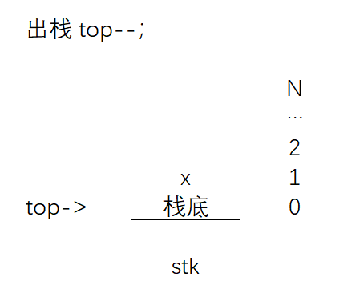

# 先来后到讲规矩：栈

> 嘿，你有没有去过青岛。在美丽的山东青岛，有一个旅客必去的打卡点——栈桥。
>
> 没去过也没关系，我们一起来想象一下：你赶在日出前一个小时，和朋友来到还没人的栈桥，从岸边快速向里走占据了栈桥第一排的观景点。随后人越来越多，人山人海把栈桥堵了个水泄不通，不过也统统只能站在你的身后。
>
> 不久，日出的美景让人陶醉，不过你想离开栈桥就有些困难，因为是第一排观景，所以要等后来的人都先出去，你才能出去。
>
> 好啦，故事讲完啦，其实在这个故事里你和其他游客就像数据元素一样完成了入栈和出栈的动作。


## 预习篇

### 1. 什么是数据结构?

数据结构(Data Structure)是计算机中一种存储和组织数据的方式，像数组就是一个典型的线性数据结构。可以把数据结构想成一个柜子，合理布局的柜子可以快速帮我们定位要找的物品（当然需要实现规整一下）。在计算中选择合适的数据结构存放数据，并维护数据，也会大大提升后续操作的效率。

虽然数据结构真的很多（新的数据结构每时每刻都在被各种算法天才发明着），不过我们会循序学习，来掌握它们！

*下面这张思维导图就是树状结构


- [ ] 太棒了😘，你读完了预习篇，了解有关数据结构的概念。

## 课后篇

### 一、这节课我学到了：


#### 1.1 什么是栈？

栈（stack）是一个“先进后出”的线性表。它只允许在表的一端进行插入（即入栈），删除（即出栈）操作。

生活中书房里摞起来的书，健身房里穿在一根柱子上的杠铃片，厨房里洗碗摞在一起的碗，都可以抽象为栈。


#### 1.2 判断出栈入栈合法性

栈是一个先入后出的线性表，且只能在表的一端对元素进行操作。历年CSP-J初赛有大量的题目考察栈的这一性质。例如下面的题目：

例题：元素*R*1、*R*2、*R*3、*R*4、*R*5入栈的顺序为*R*1、*R*2、*R*3、*R*4、*R*5。如果第1个出栈的是*R*3，那么第5个出栈的不可能是（ ）。

A. *R*1
B. *R*2​
C. *R*4​
D. *R*5​

简单还原题目中的步骤，因为先出栈的是R3，而不是R1和R2，那么肯定要将R1, R2, R3都先入栈。

步骤二，R3出栈后，栈内还剩R1和R2，此时栈顶元素为R2。可以逐一考虑几个选项是否可能。

A选项R1第5个出栈，可能。可以用如下办法去操作，入栈R4，出栈R4，入栈R5，出栈R5，出栈R2，这样R1最后一个出栈，即第5个出栈。

B选项不可以，因为无论如何R2不可能晚于R1出栈。所以答案非常明显。

- [ ] 快来试试啦~[出入栈合法性单选题](https://oj.youdao.com/csp/95?title=%E7%BA%BF%E6%80%A7%E8%A1%A8&tab=2) 

在不熟悉的时候，处理此类题目的建议是画图观察和逐一尝试每个选项。


更多的历年初赛练习：

| 单选题                                                       |
| ------------------------------------------------------------ |
| [题目一](https://oj.youdao.com/csp/95/9783?title=%E7%BA%BF%E6%80%A7%E8%A1%A8&tab=2&practiceId=95) |
| [题目二](https://oj.youdao.com/csp/95/9806?title=%E7%BA%BF%E6%80%A7%E8%A1%A8&tab=2&practiceId=95) |
| [题目三](https://oj.youdao.com/csp/95/9870?title=%E7%BA%BF%E6%80%A7%E8%A1%A8&tab=2&practiceId=95) |
| [题目四](https://oj.youdao.com/csp/95/9927?title=%E7%BA%BF%E6%80%A7%E8%A1%A8&tab=2&practiceId=95) |

#### 1.3 什么是队列 

和栈不同，队列(Queue)是一个“先进先出”的线性表。它只允许在表的一端进行“插入”（即入队）操作，在表的另一端进行“删除”（即出队）操作。

生活中的队列比比皆是，比如北京牛街卖清真点心的超市美食城总是排起长队。在环球影城里为了和威震天合个影也总是要在队列里做漫长的等待。

- [ ] [初赛中考察队列的选择题](https://oj.youdao.com/csp/95/9768?title=%E7%BA%BF%E6%80%A7%E8%A1%A8&tab=2&practiceId=95)

关于队列的内容，这次只讲这么一点点和初赛相关的知识。拓展篇中会有更多精彩的队列应用。

#### 1.4 模拟指针

什么是模拟指针，那必要要从指针“本尊”说起。指针是一个有点小特别的变量，别的变量兄弟都保存的是数据元素的值，而指针保存了地址。下面是个简单的例子：

```C++
#include <iostream>
using namespace std;

int main() {
	int a = 5;
	printf("a的值是%d。\n", a);
	printf("a的地址是%p。\n", &a);
	
	int * p = &a;
	printf("指针p的值是%p\n", p);
	
	return 0;
}
```

运行上面的代码结果如下：


怎么样发现了吗，指针保存的就是变量a的地址。

有了用指针就等于掌握了变量的地址，于是可以非常灵活的操作数据元素。不过指针“本尊”的写法和用法，在OI竞赛中并不常用。广大竞赛选手通过长期的实践发现用模拟指针更方便，程序更好调试。

一个简单的模拟指针用法示例：

```C++
//题目为给定5个数字，将其中的偶数存放在数组a中。

int a[10];
int pos = 0; // 模拟指针 pos 开始指向a数组的零位置
	
for (int i = 0; i < 5; i++) {
	int t;
	cin >> t;
	if (t % 2 == 0) {
		a[pos] = t;   // 如果读入的元素是偶数就将它放入数组a的pos位置 
		pos++;        // 同时 pos 指针右移，相当于指向下一个可以存放的位置 
	}
} 	
```

有了模拟指针这个“利器”下面就可以愉快的来模拟栈的各种操作啦。

#### 1.5 ⭐栈的基本能操作

##### 1.5.1 建栈（申请栈空间）

```C++
//栈的类型不一定是整型，但大多数时候，top指针一定是指向零位置的。
int stk[N], top = 0;
```


##### 1.5.2 入栈

```C++
//假设有一个数据元素 x 入栈
top++;   
stk[top] = x;
```


##### 1.5.3 出栈

```
// 出栈只需要将指针下移
top--;
```



##### 1.5.4 判断栈空

```
//如果top指针指向的是0位置则栈为空，否则不空
if (top != 0) {
     此时栈不空
}
```


##### 1.5.5 输出栈顶元素

```
cout << stk[top];
```


### 二、课后作业

| 题目*4                                                       |
| ------------------------------------------------------------ |
| [单选题1](https://oj.youdao.com/course/10/94/2#/3/8617)      |
| [单选题2](https://oj.youdao.com/course/10/94/2#/3/8618)      |
| [单选题3](https://oj.youdao.com/course/10/94/2#/3/8619)      |
| [给定指令模拟进出栈](https://oj.youdao.com/course/10/94/2#/1/8142) |

- [ ] 都完成啦！😀😀😀

### 三、更多的练习

这部分练习能够帮助你强化代码能力！就像运动员的力量练习。

| 题目*4                                                       |
| ------------------------------------------------------------ |
| [求阶乘的和](https://oj.youdao.com/problem/9199?from=problems) |
| [数组逆序重放](https://oj.youdao.com/problem/9041?from=problems) |
| [计算书费](https://oj.youdao.com/problem/9040?from=problems) |
| [年龄与疾病](https://oj.youdao.com/problem/9051?from=problems) |

哇！这些你都完成了，恐怖如斯~

## 拓展篇

### 一、用数组模拟队列

在课后篇提到了如何用数组模拟栈和栈的操作，那么自然有个问题，能否用数组模拟队列呢，答案自然是肯定的。

#### 1.1 建队列（队列空间初始化）

```C++
// 建立队列
int q[N];
// 初始化指向队头的指针 hh 为 0
int hh = 0;
// 初始化指向队尾得指针 tt 为 -1
int tt = -1;
```


#### 1.2 在队尾插入元素 （入队操作）

```
// 假设元素 x 入队
q[++tt] = x;
```


#### 1.3 在队头删除元素 （出队操作）

```
// 出队操作, 和出栈操作类似，都只需要一个指针操作
hh++;
```


#### 1.4 判断队列是否为空

```C++
if (tt >= hh) {
     如果队尾指针 大于等于 队头指针，表示队列中还有元素，队列不空。
} else {
     反之队列为空
}
```

#### 1.5 遍历队列元素

```C++
for (int i = hh; i <= tt; i++) {
    对q[i]进行操作;
}
```


### 二、数据结构的奇妙作用

学了栈和队列，有没有这么一种想法划过脑海，哎，好像没啥用嘛。不是说数据结构能够提升代码效率吗？现在就举个栗子。

#### 2.1 公交换乘 [2019 普及组]

##### 题目描述

著名旅游城市 B 市为了鼓励大家采用公共交通方式出行，推出了一种地铁换乘公交车的优惠方案：

1. 在搭乘一次地铁后可以获得一张优惠票，有效期为 45 分钟，在有效期内可以消耗这张优惠票，免费搭乘一次票价不超过地铁票价的公交车。在有效期内指开始乘公交车的时间与开始乘地铁的时间之差小于等于 45 分钟，即 $t_{bus}  - t_{subway} \leq  45$
2. 搭乘地铁获得的优惠票可以累积，即可以连续搭乘若干次地铁后再连续使用优惠票搭乘公交车。
3. 搭乘公交车时，如果可以使用优惠票一定会使用优惠票；如果有多张优惠票满足条件，则优先消耗获得最早的优惠票。

现在你得到了小轩最近的公共交通出行记录，你能帮他算算他的花费吗？

##### 输入描述：

输入的第一行包含一个正整数 n，代表乘车记录的数量。
接下来的 n 行，每行包含 3 个整数，相邻两数之间以一个空格分隔。第 i 行的第 1 个整数代表第 i 条记录乘坐的交通工具，0 代表地铁，1 代表公交车；第 2 个整数代表第 i 条记录乘车的票价 $price_i$；第三个整数代表第 i 条记录开始乘车的时间 $t_i$（距 0 时刻的分钟数）。
我们保证出行记录是按照开始乘车的时间顺序给出的，且不会有两次乘车记录出现在同一分钟。

##### 输出描述：

输出一行，包含一个正整数，代表小轩出行的总花费。

##### 输入样例：

```
6 
0 10 3 
1 5 46 
0 12 50 
1 3 96 
0 5 110 
1 6 135
```

##### 输出样例：

```
36
```

##### 数据范围

对于 30% 的数据，$n≤1000，ti ≤10^6 $。
另有 15% 的数据，$ti ≤10^7，price_i$都相等。
另有 15% 的数据，$ti ≤10^9，price_i$都相等。
对于 100% 的数据，$n≤10^5 ，t_i ≤10^9 ，price_i ≤1000$。


- [ ] 快来挑战[2019年CSP-J第二题](https://oj.youdao.com/problem/7155?from=problems)！


##### 分析：

**建议自己先思考，再来看分析(●ˇ∀ˇ●)。**

容易想到：

1.坐地铁是一定要花钱的，并产生一张优惠卷。

2.坐公交可以用优惠卷，也许可以遍历所有优惠卷。

3.优惠卷有“生效时间”，“面额”，“是否使用过”这三个属性，可以用一个结构体维护，也可以用一个结构体+布尔数组进行维护。

但是仔细想想真的这么简单吗？

考虑如果n的范围为$10^5$ ，如果前半程全部地铁，则生成优惠卷张数为$5*10^4$，如果采用普通数组维护这些优惠卷信息。则后半程$5*10^4$都是公交的情况下，为了查看每次乘坐公交是否有可以用到的优惠卷，则需要遍历一遍优惠卷数组，复杂度为 $2.5 * 10^9$ ,显然超时。

题目中关键一句话"**不会有两次乘车记录出现在同一分钟**", 这就说明对于每辆公交车所使用的优惠卷不会超过45张（超过45就超时了，让超时的优惠卷直接出队）。所以并不需要遍历一个全部优惠卷的数组，而只需要遍历一个最大长度为45的优惠卷队列。此时复杂度为O(45n)显然可以通过该题。


😵‍💫😵‍💫编写代码总是遇到小问题，思考超过25分钟啦？

看看[📽️题目讲解，会有帮助](https://ydschool-video.nosdn.127.net/1675317225204)！
