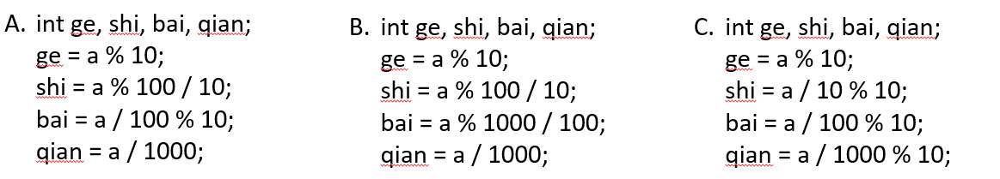

# 关于数位的奥秘

## 预习篇

### 1. 拆分一个数的各位数字

一个数字，由数位和每个数位上的数字组成。

数位，是指一个数中每个数字所占的位置。

例如，153，就是一个三位数，含有个、十、百3个数位。

那如何将153的各位数字拆分出来呢？

|      |        百位        |       十位        |     个位     |      |
| :--: | :----------------: | :---------------: | :----------: | :--: |
| 153  | 153 / 100 % 10 = 1 | 153 / 10 % 10 = 5 | 153 % 10 = 3 |      |

因此，对于一个三位数 n，我们可以使用这种方法得到每一位上的数字：

|      |     百位     |    十位     |  个位  |      |
| :--: | :----------: | :---------: | :----: | :--: |
|  n   | n / 100 % 10 | n / 10 % 10 | n % 10 |      |

动手练习：

- [ ] [反向输出一个三位数](https://oj.youdao.com/problem/7906?from=problems)

## 课后篇

### 一、这节课我学到了：


#### 1.1 什么是数位？

一个数字，由符号位、数位和每个数位上的数字组成。

数位，是指一个数字中每一个数字所占的位置。

例如，153，就是一个三位数，含有个、十、百3个数位。

#### 1.2 数位拆分问题

##### 1.2.1 定长数字的数位拆分

以四位数字为例，对四位数拆分的方法有很多，如下：



以上三种都是正确拆分四位数字的方法，因此我们可以总结一个规律，模运算%可以取到数字的后几位，除法运算/可以抹去数字的后几位。

##### 1.2.2 不定长数字的数位拆分

但当我们遇到不知道有多位的数字该如何拆分呢？根据上述C选项可知，只需重复执行%10和/10的操作，直到原数字为0为止，即可得到每位上的数字。

数位拆分步骤如下：

1. 取该数字中最末位上的数字%10；
2. 将最末位上的数字抹掉/10；
3. 接下来再对这个新的数字重复上述过程；
4. 直到该数字仅剩0为止。

数位拆分模板如下：

```c++
int n;		//原数字
while(n != 0){		//循环条件
	 cout << n % 10;	//取末位
	 n = n / 10; 		//抹掉末位
}
```

- [ ] 题目练习：尝试补全程序

###### 题目描述

请统计某个给定范围[L, R]的所有整数中，有多少个数字包含 8 ，若一个数字包含多个8，则算作一个数字。

###### 输入格式

 输入共 1 行，为两个正整数 L 和 R，之间用一个空格隔开。1 ≤ L ≤R≤ 10000。

###### 输出格式

输出共 1 行，表示L和R之间（包含L和R），有多少个数字包含8。

```C++
//尝试填空
#include <iostream>
using namespace std;
int main() {
    //定义输入
    int L, R;
    cin >> L >> R;
    int cnt = 0;
    //遍历L到R（包括L和R）间的所有数字
    for (int i = L; i <= R; i++) {
        ???;
        //拆分每一个数字，判断当前数字是否包含8
        while (t != 0) {
            if (???){
            	cnt++;
            	???;
	         } 
            ???;
        }
    }
    cout << cnt << endl;
    return 0;
}
```

#### 1.3 数字重组问题

当拆分的数字末尾含0或为负数时，就不能简单地循环输出末尾上的数字，在这里我们学习了数字重组。依然要利用%10和/10不断取出最后一位，但不能直接输出，而要加到一个新数的末尾，最终这个新数就是合法的答案。

|       |  n   | %10得到末位 | 末尾加入新数 | 除以10后的n |
| :---: | :--: | :---------: | :----------: | :---------: |
| 第1轮 | -380 |      0      |      0       |     -38     |
| 第2轮 | -38  |     -8      |      -8      |     -3      |
| 第3轮 |  -3  |     -3      |     -83      |  0（结束）  |

数字重组步骤如下：

1. 取该数字中最末位上的数字；
2. 新数字权重*10+取到的最末位数字
3. 将最末位上的数字抹掉；
4. 接下来再对这个新的数字重复上述过程；
5. 直到原数字仅剩0为止

数字重组模板如下：

```c++
int num = 0;   //新数字基础为0
while(n != 0){
     int k = n % 10;
	 num = num * 10 + k;   //组成新数字
	 n = n / 10; 
}
```

- [ ] 题目练习：尝试补全程序

###### 题目描述

一个整数的“反置数”指的是把该整数的每一位数字的顺序颠倒过来所得到的另一个整数。如果一个整数的末尾是以0结尾，那么在它的反置数当中，这些0就被省略掉了。请编写一个程序，输入两个整数，然后计算这两个整数的反置数之和sum，然后再把sum的反置数打印出来。

###### 输入格式

输入只有一行，包括两个正整数（小于10^9)，中间用空格隔开。

###### 输出格式

输出只有一行，即相应的结果。

```c++
//尝试填空
#include<cstdio> 
//一共进行了三次反置操作，使用函数可以简化代码
int revert(int x){
	int d, answer = ?;
	//逐位反置
	while(x > 0) {
		d = x % 10;
		???;
		???; 
	}
	return answer;
}
int main(){
	int a,b;
	scanf("%d%d", &a, &b);
	printf("%d", ???);
	return 0;
}
```

### 二、课后作业

| 题目 * 3                                                     |
| ------------------------------------------------------------ |
| [填空题](https://oj.youdao.com/course/10/95/2#/3/8631)       |
| [如果写不出好的和弦就在洒满阳光的钢琴前一起吃布丁](https://oj.youdao.com/course/10/95/2#/1/8153) |
| [阅读程序写结果](https://oj.youdao.com/course/10/95/2#/3/8632) |

- [ ] 都完成啦！😀😀😀

### 三、更多的练习

| 题目 * 6                                                     |
| ------------------------------------------------------------ |
| [级数求和](https://oj.youdao.com/problem/9193?from=problems) |
| [数1的个数](https://oj.youdao.com/problem/9209?from=problems) |
| [含k个3的数](https://oj.youdao.com/problem/9195?from=problems) |
| [向量点积计算](https://oj.youdao.com/problem/9044?from=problems) |
| [统计数字字符个数](https://oj.youdao.com/problem/9063?from=problems) |
| [找和为K的两个元素](https://oj.youdao.com/problem/9287?from=problems) |

- [ ] 哇！这些题也完成了，给你360度旋转的赞👍

### 四、挑战题目

这部分题目难度较大，需要对所学知识点灵活运用，如果暂时搞不定，可以过段时间回来再来自测，发现自己的进步哦~

| 题目 * 4                                                     |
| ------------------------------------------------------------ |
| [拆分计算](https://oj.youdao.com/problem/12614?from=problems) |
| [新式乘法](https://oj.youdao.com/problem/12615?from=problems) |
| [数位不下降的数](https://oj.youdao.com/problem/12610?from=problems) |
| [计数问题加强版](https://oj.youdao.com/problem/12621?from=problems) |

- [ ] 挑战题也全部完成，不愧是我！

## 拓展篇

### 一、使用字符串解决问题

对于数字的拆位问题，可以将数字当作字符串处理，尤其是解决大数字的数字反转问题。下面介绍未知长度单个字符的循环输入与输出，并使用字符串来解决数位拆分和数字重组问题。

#### 1.1 未知长度单个字符循环输入与输出

##### 1.1.1 输入

1. 使用cin读入，只要有字符能够读入，其结果即为真；当没有字符可以读入，结果为假，循环结束。

   ```c++
   while (cin >> a[len]) len++;
   ```

2. scanf判输入是否终止，EOF（end of file）是文件结束符，当scanf读取内容发生错误或者读到文件结尾的时候就会返回EOF。

   ```c++
   while(scanf(" %c", &a[len]) != EOF) len++;
   ```

3. scanf判占位符个数，scanf 返回值表示成功输入参数的个数。

   ```c++
   while(scanf(" %c", &a[len]) == 1) len++;
   ```

##### 1.1.2 输出

1. 使用while

   ```C++
   while(len--)cout << a[len];
   //while(n--)常用于让循环执行n次
   ```

2. 使用for

   ```c++
   for(int i = len – 1; i >= 0; i--）
   	cout << a[i];
   ```

#### 1.2 使用字符串处理**不含**负数和末尾0的数字反转问题

将数字当作字符串读入字符数组中，再从后往前逆序遍历数组输出即可。

```c++
char a[10];				
int len = 0;	//代表当前a数组中字母的长度数量
while(cin >> a[len]) len++;	//一位一位读，能读就继续
while(len--)cout << a[len];	//len递减输出
```

#### 1.3 使用字符串处理**含**负数或末尾0的数字反转问题

此时需特判负号和末尾0的情况。将负数和正数分开处理，若为正数，则从后向前遍历数组，循环跳过末尾的所有0，直至第一个非0数字字符后，逆序输出；若为负数，需先输出负号“-”，再进行上述操作。

```c++
char a[21];
cin >> a;
int len = strlen(a);
if(a[0] == '-'){  //处理负数
    cout << '-';
    while(a[len - 1] == '0' && len > 1) len--;	//跳过末尾0
    while(a[len - 1] != '-'){
    	cout << a[len - 1];
    	len--;
    }
}else{
    while(a[len - 1] == '0' && len > 1) len--;	//跳过末尾0
    while(len--) cout << a[len];
}
```

#### 1.4 数字反转（升级版）

接下来动动脑筋思考一下，如何处理小数、分数、甚至百分数的数字反转呢，就让我们使用字符串来解决更难的数字反转问题吧~

###### 题目描述

给定一个数，请将该数各个位上数字反转得到一个新数。这个数可以是小数，分数，百分数，整数。
翻转方式如下：

1. 整数反转是将所有数位对调。
2. 小数反转是把整数部分的数反转，再将小数部分的数反转，不交换整数部分与小数部分。
3. 分数反转是把分母的数反转，再把分子的数反转，不交换分子与分母。
4. 百分数中百分号前的数字一定是整数，百分数只改变数字部分。

数据保证:
对于整数翻转而言，整数原数和整数新数满足整数的常见形式，即除非给定的原数为零，否则反转后得到的新数和原来的数字的最高位数字不应为零。
对于小数翻转而言，其小数点前面部分同上，小数点后面部分的形式，保证满足小数的常见形式，也就是原数小数点部分的末尾没有多余的 0（但是存在类似1.0这样的形式，此时需要保留 1 个 0。若反转之后末尾数字出现 0，请省略多余的 0）
对于分数翻转而言，分数不约分，分子和分母都不是小数。输入的分母不为0。与整数翻转相关规定见上。
对于百分数翻转而言，见与整数翻转相关内容。注意所有数据不存在负数。

###### 输入格式

一个数 s

###### 输出格式

一个数，即 s 的反转数

###### 输入输出样例

**输入 #1**

```
5087462
```

**输出 #1**

```
2647805
```

**输入 #2**

```
600.084
```

**输出 #2**

```
6.48
```

**输入 #3**

```
700/27
```

**输出 #3**

```
7/72
```

**输入 #4**

```
8670%
```

**输出 #4**

```
768%
```

###### 提示

所有数据：20%是整数，不大于20位
30%是小数，整数部分和小数部分均不大于10位
30%是分数，分子和分母均不大于10位
20%是百分数，分子不大于19位


- [ ] 挑战一下[数字反转（升级版）](https://oj.youdao.com/problem/9357?from=problems)


###### 解析

**一定要先思考，再来看解析哦~**

由题可知：整数和百分数的反转规则相同，都是将整数的数位对调；小数和分数是符号左右两边看作两个数进行反转，因此可以分成两大类进行讨论。

1. 对整数、百分数类型特判

   整数反转与拓展篇1.3 部分相同，由于题目数据不存在负数，所以只需跳过末尾所有0即可。百分数则在反转后再输出百分号“%”。

2. 对小数、分数类型特判

   需标记符号位所在的位置，将符号两边的数字分别处理。

   首先处理左侧数字，从符号位开始逆序跳过末尾0，找到第一个非0数字，逆序输出；

   其次，输出相应符号；

   最后处理右侧数字，由于小数从小数点后第一个非0字开始反转，因此需顺序跳过所有0后，再从末尾逆序跳过末尾0，剩余的数字逆序输出。

已经知道做题思路，看看可不可以正确完成这道题目啦！
