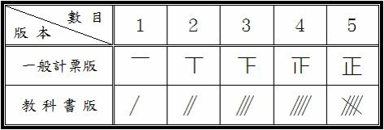
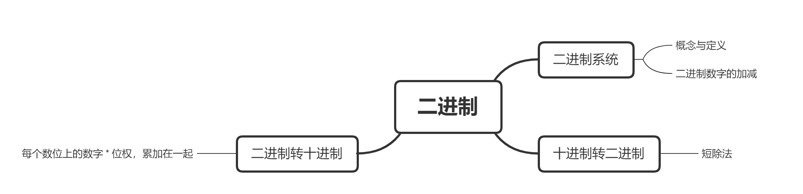
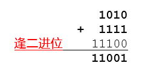
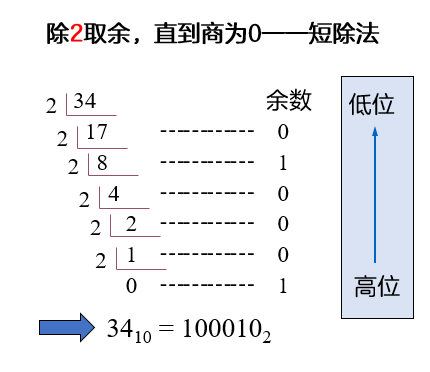
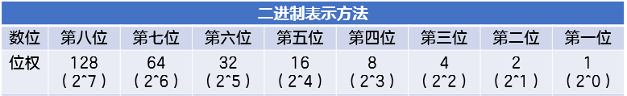
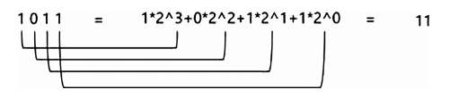
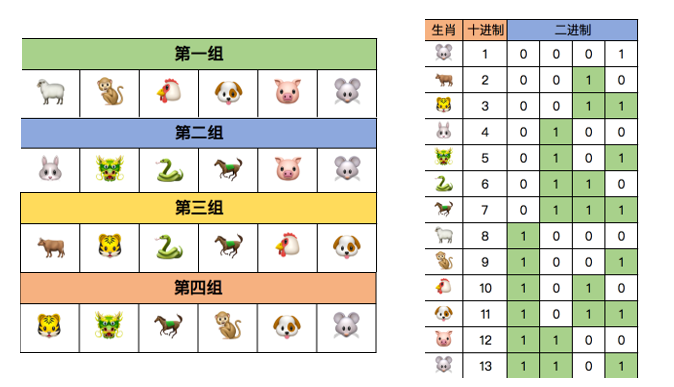
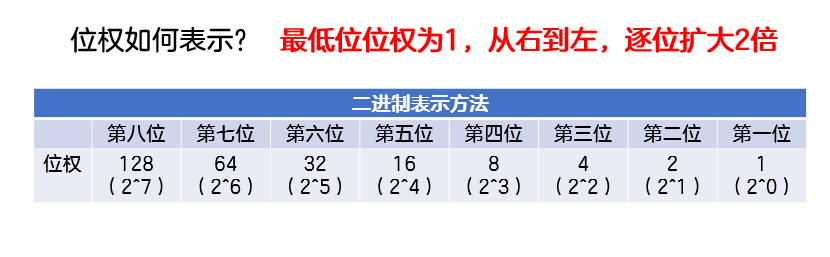
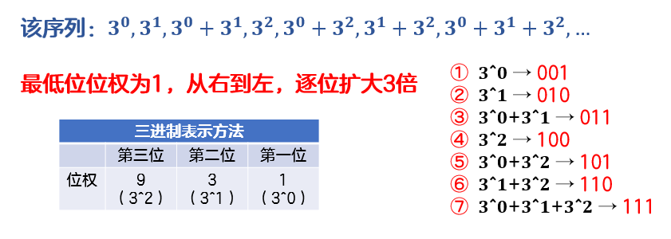

# 初识0与1的世界

> Hey！我们来玩个游戏吧~接下来我会给出4组生肖图片，请你根据自己的生肖，在纸上写出“有”或“没有”。我会根据你的答案，快速说出你的生肖！
>
> 我的答案是“没有 有 没有 有”，也请你猜猜我的生肖是什么？
>
> //这里的设想：做一个动画，把这四组分别展出，播完第一组，让学生在方框内选择√或者×；播完这四组后，直接显示该学生的生肖。


## 预习篇

### 1. 什么是进制?

进制是人们规定的一种带进位的计数方法。现如今我们习惯于使用“满十进一”的十进制计数法。因为可以用0~9这10个有限的数字就可以表示所有的数值。但是只有十进制计数法吗?当然不是!

比如我们在班级里选举唱票的时候，经常会用到的“正”字计数法，就是一种“满五进一”的计数方法。一个“正”字有五画，代表数字“5”，也就是5票，两个“正”字就可以代表数字“10”。



除此之外还有很多不同的计数方法。比如中国明代的“二五珠”算盘使用的是十六进制；英制单位中一英尺等于12英寸的十二进制；计算机电路中使用的二进制。

它们与十进制之间的区别仅仅是进位和符号不同而已。

### 2. 计算机与0和1有什么关系?

我们知道十进制可以用0~9这10个数字来表示。请聪明的你想一想，二进制可以用哪些数字来表示呢？

没错，二进制是用0和1来表示。也许你曾知道计算机采用的是二进制系统，那么你是否了解过为什么计算机选择二进制系统，而不是十进制系统呢？

这是因为找到一种物质，可以具备3种及以上状态，制造困难且可靠性低。比如人类有十根灵活的手指头，可以表示十种状态，所以人类更习惯十进制。而计算机是基于一种开关式的电路，它只有通电和断电两种状态，所以目前的计算机更习惯二进制。


//这里的设想：可以做一个小动画，一个灯和一个开关，学生可以通过控制灯的开关，更直观的感受二进制

- [ ] 太棒了😘，你读完了预习篇，了解有关二进制的概念。

## 课后篇

### 一、这节课我学到了：




#### 1.1 二进制系统

##### 1.1.1 位和字节

单条线路上的开、关，被称为一位（bit）。

位（bit）是计算机能够存储信息的最小单位。


字节（ Byte ）是计算机存储信息的基本单位。1Byte(字节) = 8 bit(位)


*位（bit）和字节（Byte）的概念不要弄混哦~

- [ ] 快来试试啦~[位和字节]([2010-NOIP-J-2-信息学奥赛题库-有道小图灵 (youdao.com)](https://oj.youdao.com/csp/86/9716?title=字节与字&tab=2&practiceId=86))

##### 1.1.2 二进制数字的加法与减法

二进制是计算机中广泛使用的一种进制，用0和1两个数码来表示。比如1010就是一个二进制数字。

二进制的进位规则是“满二进一”，借位规则是“借一当二”。比如1010+1111=11001。



- [ ] 快来试试啦~[二进制加法](https://oj.youdao.com/csp/87/9890?title=进制的基本概念与进制转换&tab=2&practiceId=87)

- [ ] 二进制减法：101001 - 011010 = ？（注：得到的二进制数字共六位，不足六位在前补零）

  正确答案：001111

  //这里想设一个链接，但是传到题库里面，发现填空和选择题搜不到，暂时以这种形式放这里

#### 1.2 十进制转二进制

十进制数转二进制数其实就是确定一个十进制数是由几个1、几个2、几个4、几个8……累加起来的，使用的方法是短除法。

比如，如何计算十进制数字34对应的二进制数字呢？我们可以用2整除34，得到商17，余数为0；接下来再用2去整除17，得到商为8，余数为1；如此重复，直到商为0。从最后一个余数到第一个余数依次罗列，100010就是十进制数字34的二进制表示了。



⭐如何编程实现十进制转二进制呢？下面是一个简单的例子：

核心思路：短除法，除2取余，直到商为0，从最后一位到第一位输出（可以参考十进制的数字拆位）

```C++
#include <cstdio>
int main(){
    int n;
    scanf("%d", &n);
    int len = 0, a[100] = {};
    while (n > 0){
 	   a[len++] = n % 2; //注意len 和 ++的先后顺序
 	   n /= 2;
    }
    for (int i = len - 1; i >= 0; i--){ //注意输出时的下标顺序
        printf("%d", a[i]);
    }
    return 0;
}
```

- [ ] 接下来请你仿照十进制转二进制的程序，写出十进制转八进制的程序吧！(请在空白处补全代码)

```C++
#include <cstdio>
int main(){
    int n;
    scanf("%d", &n);
    int len = 0, a[100] = {};
    while (n > 0){
 	                   //第一个空
 	                   //第二个空  
    }
    for (      ;      ;     ){ //for循环中三个条件都是什么？
        printf("%d", a[i]);
    }
    return 0;
}
```

#### 1.3 二进制转十进制

二进制每一数位对应位权从右到左依次为1，2，4，8，.....以此类推，皆为2的整数次方。

下表表示二进制数字的位权（前八位）：



计算一个与二进制数字等价的十进制数字是多少，只需要将对应位的位权和数字相乘并且累加。

比如1011就是一个四位二进制数，可以表示十进制数字11，由1个8、0个4、1个2和1个1相加组成，下图所示为具体计算过程。



⭐如何编程实现二进制(不超过十位的二进制数)转十进制呢？下面是一个简单的例子：

核心思路：将该二进制数字中的每一位数字拆分出来，方法与十进制拆位相同；将该数字乘上对应位权，并且累加起来

```C++
#include <cstdio>
int main(){
    int n;
    scanf("%d", &n);
    int ans = 0;
    int w = 1;     //位权
    while (n > 0){
        int tmp = n % 10;    //从末尾开始，取出每一位数字
        ans = ans + tmp * w; // ans = （每一轮数字 * 位权）的和
        w = w * 2;           //位权的变化
        n = n / 10;          //消掉当前已处理的数字
    }
    printf("%d", ans);
    return 0;
}
```

- [ ] 接下来请你仿照二进制转十进制的程序，写出八进制转十进制的程序吧！(请在空白处补全代码)

```C++
#include <cstdio>
int main(){
    int n;
    scanf("%d", &n);
    int ans = 0;
    int w =    ;     //位权
    while (n > 0){
        int tmp = n % 10;    //从末尾开始，取出每一位数字
        ans =    ;         // ans = （每一轮数字 * 位权）的和
        w =      ;           //位权的变化
        n =      ;          //消掉当前已处理的数字
    }
    printf("%d", ans);
    return 0;
}
```


> 恭喜！现在你已经掌握二进制与十进制之间的转换啦~还记得我们最开始玩的猜生肖游戏吗？接下来为你揭秘这个游戏的逻辑：
>
> 在游戏开始前，我用2-13为12个生肖编号，并将这12个十进制的编号转换为二进制的编号，如下图：
>
> 
>
> 比如你的答案是“没有 有 有 有”，那么就在表格中找到“0111”对应的生肖-马。是不是很神奇呢？
>
> 在你熟练掌握十进制与二进制的转换后，也可以拿这个小游戏问问身边的人哦~

### 二、课后作业

| 题目*4                                                     |
| ---------------------------------------------------------- |
| [选择题1]((https://oj.youdao.com/course/10/97/2#/3/8645))  |
| [填空题2](https://oj.youdao.com/course/10/97/2#/3/8646)    |
| [填空题3](https://oj.youdao.com/course/10/97/2#/3/8647)    |
| [0与1的故事](https://oj.youdao.com/course/10/97/2#/1/8160) |

- [ ] 都完成啦！😀😀😀

### 三、更多的练习

这部分练习能够帮助你强化代码能力！就像运动员的力量练习。

| 题目*4                                                       |
| ------------------------------------------------------------ |
| [球弹跳高度的计算](https://oj.youdao.com/problem/9242?from=problems) |
| [图像相似度](https://oj.youdao.com/problem/9057?from=problems) |
| [字符替换](https://oj.youdao.com/problem/9069?from=problems) |
| [最长平台](https://oj.youdao.com/problem/9082?from=problems) |

哇！这些你都完成了，恐怖如斯~

### 四、更有难度的挑战

这部分题目的难度达到了算法竞赛的难度，需要基于代码基本功，思维还有本节课知识之上才加以灵活运用，如果暂时搞不定，千万不要灰心。可以过段时间回来再来检测自己水平是否进步了~

| 更难的题目*3                                                 |      |
| ------------------------------------------------------------ | ---- |
| [小图灵统计票数](https://oj.youdao.com/problem/12933?from=problems) |      |
| [小图灵数字](https://oj.youdao.com/problem/12935?from=problems) |      |
| [PQ进制的相互转换](https://oj.youdao.com/problem/12931?from=problems) |      |

## 拓展篇

### 数列 [NOIP2006普及组]

##### 题目描述：

给定一个正整数 k (3 ≤ k ≤ 15)，把所有 k 的方幂及所有有限个互不相等的k的方幂之和构成一个递增的序列，例如，当 k = 3 时，这个序列是：1, 3, 4, 9, 10, 12, 13,…

（该序列实际上就是：3^0^, 3^1^, 3^0^+3^1^, 3^2^, 3^0^+3^2^, 3^1^+3^2^, 3^0^+3^1^+3^2^,…，）
请你求出这个序列的第 N 项的值（用10进制数表示）。
例如，对于 k = 3，N = 100，正确答案应该是981。

##### 输入描述：

2个正整数，用一个空格隔开：k和N（k、N的含义与上述的问题描述一致，且3 ≤ k ≤ 15, 10 ≤ N ≤ 1000）。

##### 输出描述：

1个正整数。（整数前不要有空格和其他符号）。

##### 输入样例：

```
3 100
```

##### 输出样例：

```
981
```


- [ ] 快来挑战[NOIP2006普及组第四题](https://oj.youdao.com/problem/13114?from=problems)！


##### 分析：

**建议自己先思考，再来看分析(●ˇ∀ˇ●)。**

这道题先不要着急去编程，需要我们先找规律，再来求解。

题目要求我们找到一个序列，其中包含所有 k 的方幂及所有有限个互不相等的 k 的方幂之和，并且这个序列是递增的。我们以题干中给出的 k = 3 为例来分析，这个序列为 1, 3, 4, 9, 10, 12, 13,…

我们不妨来找一找其中的规律。

当这些k的方幂出现时，不如想想哪部分的知识用到了方幂之和呢？没错，是在二进制转十进制的时候。



现在我们已知的序列是3^0^, 3^1^, 3^0^+3^1^, 3^2^, 3^0^+3^2^, 3^1^+3^2^, 3^0^+3^1^+3^2^,…，如何把它们串联起来呢？请看下面的图片。



你会发现，在k进制下，该数列其实是1,10,11,100,101,110,111……也就是二进制下的1到n。

因此，我们可以对于每一个数，先确定一组表示它方幂的系数，再用二进制数来表示这些系数。例如，对于第五个数3^0 + 3^2，我们可以用二进制数 101 来表示它的系数 {1, 0, 1}。

于是我们就把问题转化为：将 N 转化为二进制数，然后按位计算每一位的值。如果该位为 1，则乘上对应的方幂，并相加。最终得到的就是这个序列的第 N 项的值。

**核心思路：**

1.将 N 转化为二进制数，按位计算每一位的值。

2.再将该二进制数视为k进制，转回十进制。

（该过程可以简化：一边转二进制，一边计算每个二进制位对应的k进制权重；若该二进制位填的是1，则将答案加上该位对应的k进制权重。）

标程如下：

```C++
#include <cstdio>
int main(){
    int k, n;
    scanf("%d%d", &k, &n);
    long long ans = 0, q = 1; //注意ans最大可以到15进制的10位数，超过了int的上限（10 ^ 9）
    while (n > 0){
        if (n % 2 == 1){
            ans = ans + q;
        }
        n /= 2;
        q *= k;
    }
    printf("%lld", ans);
    return 0;
}
```

