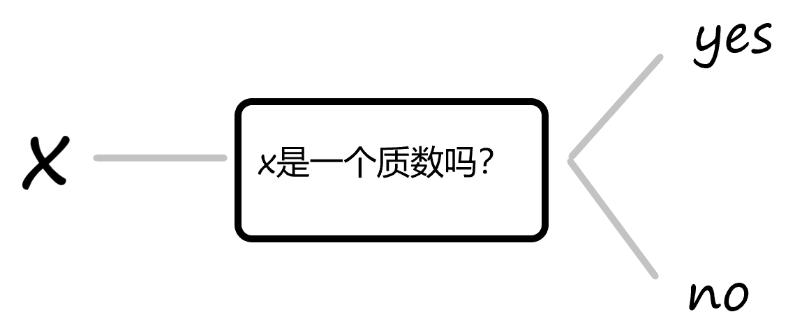
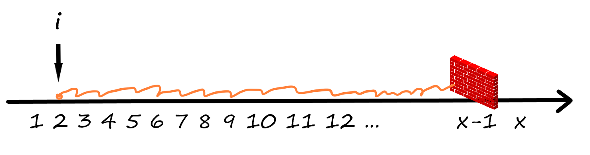
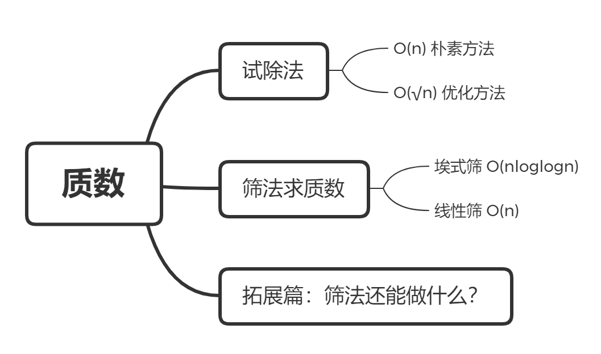
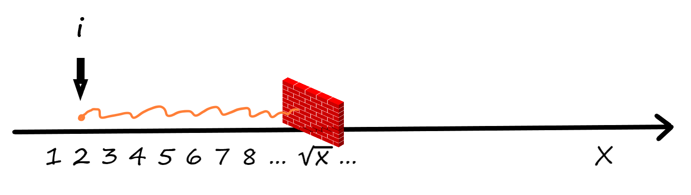
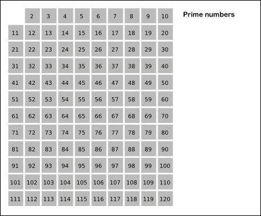

# 筛法求质数



> 质数又称素数。一个大于1的自然数，除了1和它本身外，不能被其他自然数整除，就叫质数，否则称为合数。
>
> 此外特别规定，1既不是质数，也不是合数。
>
> 本章的内容将围绕如何快速求出质数展开。

## 预习篇

### 1.自然数，整除，因数，约数

先来回忆几个数学概念：

自然数集是全体**非负整数**组成的集合，表示为 $\mathbb{N} = \{0, 1, 2, 3, ...\}$。

**整除**是两个自然数之间的一种关系。

自然数$a$可以被自然数$b$整除，是$a$除以$b$没有余数。此时$b$是$a$的**因数**或称**约数**，$a$是$b$的整数倍数。

```C++
if (a % b == 0) {
    printf("b整除了a.");
} 
```

### 2. 质数和朴素试除法

质数是指只能被1和其自身整除的数。

判断一个数$x$是否是质数（很多时候称为素性测试），最简单的方法是试除法。试除，就是用${2, 3, ... , x-1}$这些数字尝试整除$x$。只要其中有一个数能整除$x$，就说明$x$是合数，反之是质数。

```C++
// 写成函数形式的试除法，若为合数函数返回0，为质数函数返回1
bool isPrime(int x) {
    if (x < 2) return 0;
    for (int i = 2; i < x; i++) {
        if (x % i == 0) return 0;
    }
    return 1;
}
```

程序的过程，就像在数轴$x-1$的位置建了一堵墙，i从2开始不断右移到这堵“墙”，每次都要进行 $x \% i $的计算，若结果为0，说明$i$是$x$的因数，$x$是合数。




- [ ] 完成预习题目，温习质数知识：

[质数数量](https://oj.youdao.com/problem/13557?from=problems)

难度升级，嘣嘣嘣嘣~

❓如果给定的数字是一个小于 $2^{63}$的数字，限定1000ms内判断出它是否为一个素数，那么还可以使用刚才的朴素试除法吗？

## 课后篇



### 1.1 更优的试除法

上过课的你肯定知道了更好的试除法，不需要试验到x-1，而只需要试验到$\sqrt[]{x}$。时间复杂度也随之变为$O(\sqrt[]x)$。

```C++
// 优化后的试除法
bool isPrime(long long x) {
    if (x < 2) return 0;
    // 将 i < x 优化为 i * i <= x
    for (long long i = 2; i * i <= x; i++) {
        if (x % i == 0) return 0;
    }
    return 1;
}
```

可以理解为，墙从$x-1$的位置移动到了$\sqrt[]{x}$的位置。




优化后的试除法，对于预习篇中1个的较大数字够用了，但是如果要是判断n个数字是否为质数，当n的大小为$10^6$时，整体时间复杂度为$O(n\sqrt[]{n})$，又会超时。要解决这个问题，就需要来继续学习筛法。

### 1.2 朴素筛法

所谓筛法，把所有不是质数的数筛去，剩下的就是质数了。对于两个大于 $1$ 的整数 $i,j$ , $i * j$一定不是质数。由此可以得到一个朴素的筛法。

```C++
const int N = 1e6+10;  // 筛出10^6 以内的所有质数
int primes[N], idx;    // 数组primes用来存放质数，idx是数组模拟指针
bool st[N];            // st[i]为0表示i为质数，为1表示i为合数

for (int i = 2; i < N; i++) {
    if (!st[i]) {                           //如果i没有被筛出去
        primes[idx++] = i;                  //那么i是一个质数
    }                                       
    for (int j = 2 * i; j < N; j += i) {    // 将i的所有倍数都标记为合数
        st[j] = 1;
    }
}
```

朴素筛的算法为$O(nlogn)$。这个算法存在一些重复的计算，比如10即是2，也是5的倍数，这样就被标记了2次。又比如100，就要被2，4，5，10，20，25，50标记7次。越大的数字被标记的次数越多。

观察朴素的筛法能够得到一个启发，一个合数必定有一个质因子。那么就只用质数进行筛，这个效率就能提高了。这种想法就是埃式筛。

### 1.3 埃拉托斯特尼筛法（sieve of Eratosthenes）

埃式筛得名于古希腊数学家埃拉托塞尼（**Eratosthenes**），他计算了地球的周长，并且设计了现在为人熟知的经纬系统。

埃式筛用来找出一定范围的所有质数，它的原理非常简单，从2开始，将每个质数的倍数标记成合数。时间复杂度为$O(loglogn)$。

实现的过程中先定出要筛数值$n$，找出$\sqrt[]{n}$以内的素数$p_1,p_2,...,p_k$。先用2去筛，剔除2的所有倍数，再用3去筛，直到剔除了$p_k$的所有倍数为止。

下面这张动图能够帮助我们理解这个过程：




```C++
const int N = 1e6+10;  // 筛出10^6 以内的所有质数
int primes[N], idx;    // 数组primes用来存放质数，idx是数组模拟指针
bool st[N];            // st[i]为0表示i为质数，为1表示i为合数

void eSieve() {
    // 只要判断到根号N就可以把N以内所有质数筛出
    for (int i = 2; i * i < N; i++) {   
        // 如果i是质数，则要把i的所有倍数都标记为合数
        if (!st[i]) {
            // 将i放进质数数组
            primes[idx++] = i;
            // 如果i * i超过N的范围则不标记，防止数组越界
            if (1LL * i * i >= N) continue;
            /* 将i的所有倍数标为合数，这里筛的时候j从i*i开始，而不是从2*i开始
            是因为 i 之前的倍数一定被之前的筛掉了*/
            for (int j = i * i; j < N; j += i) {
                st[j] = 1;
            }
        }
    }
}
```

### 1.4 线性筛

仔细观看埃式筛的过程，比如数字12和18就被2和3各自筛掉一次，令一个合数$x$只被它的最小质因子$p_x$筛出，就得到了线性筛，时间复杂度为$O(n)$。

```C++
const int N = 1e7+10;  // 线性筛可以在1s内筛出10^7 以内的所有质数
int primes[N], idx;    // 数组primes用来存放质数，idx是数组模拟指针
bool st[N];            // st[i]为0表示i为质数，为1表示i为合数

void lSieve() {
    for (int i = 2; i < N; i++) {
    	if (!st[i]) {
    		primes[idx++] = i;
    	}
    	for (int j = 0; j < idx && primes[j] * i < N; j++) { // 枚举当前所有质数 primes[j]
    		st[i * primes[j]] = 1;                           // i的primes[j] 倍是合数
    		if (i % primes[j] == 0) break;                   // 线性筛的神奇之处~
    	}
    }
}
```

设 $x$ 的最小质因子为 $p_x$ ,例如 $p_9 = 3, p_{16} = 2$ 。那么在线性筛中，**一个合数 $x$ 会且仅会在$i = x/p_x$的时候筛去**。

❓为什么增加一句判断就可以结束内层循环呢

证明充分性，合数  $x$ 会在 $i = x/p_x$ 的时候筛去。显然有 $x/p_x \geq p_x$ ，否则 $x/p_x$ 的最小质因子一定比 $p_x$ 小，且它也是 $x$ 的一个质因子，那么 $x$ 的最小质因子就不是 $p_x$，这与 $p_x$ 是 $x$ 最小质因子矛盾。

证明充分性，合数 $x$ 仅会在 $i = x/p_x$ 的时候筛去。设 $p_{x+k}$ 是一个大于 $p_x$ 的 $x$ 的质因子，那么当 $i = x/p_{x+k}$ 时，在枚举到 $p_{x+k}$ 之前，内存循环已经 `break `掉了。考虑因为 $p_{x+k}$ 和 $p_x$ 都是质数，所以互质，且同时是 $x$ 的质因子，所以 $p_x$ 也一定是 $x/p_{x+k}$ 的质因子，否则和算术基本定理矛盾，那么当枚举到 $p_x$ 时，就整除 $i$ 了，不会再枚举到 $p_{x+k}$。

综上对于每一个合数，都只会被``st[i*primes[j]] = 1`标记一次，实际执行不超过n次，整个算法复杂度不超过$O(n)$。

### 1.5 必须要完成的作业

| 作业 * 5                                                    |
| ----------------------------------------------------------- |
| [阅读程序](https://oj.youdao.com/course/10/99/2#/3/8653)    |
| [填空题](https://oj.youdao.com/course/10/99/2#/3/8652)      |
| [素数的个数](https://oj.youdao.com/course/10/99/2#/1/8173)  |
| [质因数分解](https://oj.youdao.com/course/10/99/2#/1/9212)  |
| [第n小的质数](https://oj.youdao.com/course/10/99/2#/1/9213) |

### 1.6 更多的练习

| 练习题 * 1                                                   |
| ------------------------------------------------------------ |
| [区间内的真素数](https://oj.youdao.com/problem/9274?from=problems) |

## 挑战篇

### 真题挑战 

[2021年CSP-J初赛第18题，阅读程序](https://oj.youdao.com/csp/80/10040?title=2021CSP%E5%85%A5%E9%97%A8%E7%BA%A7%E7%AC%AC%E4%B8%80%E8%BD%AE%E8%AE%A4%E8%AF%81&tab=3&practiceId=80)，原题有视频题解

```C++
1 	#include <stdio.h>
2 
3 	#define n 100000
4 	#define	N n+1
5 
6 	int m;
7 	int a[N], b[N], c[N], d[N];
8 	int f[N], g[N];
9 
10	void init() 
11	{
12		f[1] = g[1] = 1;
13		for (int i = 2; i <= n; i++) {
14			if (!a[i]) {
15				b[m++] = i;
16				c[i] = 1, f[i] = 2;
17				d[i] = 1, g[i] = i + 1;
18			}
19			for (int j = 0; j < m && b[j] * i <= n; j++) {
20				int k = b[j];
21				a[i * k] = 1;
22				if (i % k == 0) {
23					c[i * k] = c[i] + 1;
24					f[i * k] = f[i] / c[i * k] * (c[i * k] + 1);
25					d[i * k] = d[i];
26					g[i * k] = g[i] * k + d[i];
27					break;
28				}
29				else {
30					c[i * k] = 1;
31					f[i * k] = 2 * f[i];
32					d[i * k] = g[i];
33					g[i * k] = g[i] * (k + 1);
34				}
35			}
36		}
37	}
38
39	int main() 
40	{
41		init();
42		
43		int x;
44		scanf("%d", &x);
45		printf("%d %d\n", f[x], g[x]);
46		return 0;
47	}
```

假设输入的$x$是不超过1000的自然数，完成下面的判断题和单选题：
•判断题
1）若输入不为”1”，把第12行删去不会影响输出的结果。（）
A.正确    
B.错误

2）第24行`f[i * k] = f[i] / c[i * k] * (c[i * k] + 1)`中的” `f[i]/c[i*k]`”可能存在无法整除而向下取整的情况。（）
A.正确    
B.错误

3）在执行完$init()$后，f数组不是单调递增的，但$g$数组是单调递增的。（）
A.正确    
B.错误

•单选题
4）$init$函数的时间复杂度为（）。
A.$O(n)$    
B.$O(n log n) $
C.$O(n √n) $
D.$O(n^2)$

5）在执行完$init()$ 后，$f[1], f[2], f[3] ...... f[100]$中有（）个等于2。
A.23    
B.24    
C.25    
D.26

6）当输入”1000”时，输出为（）。
A.”15 1340”    
B.”15 2340”    
C.”16 2340”    
D.”16 1340”
