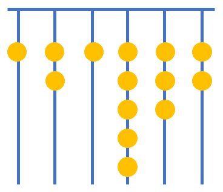
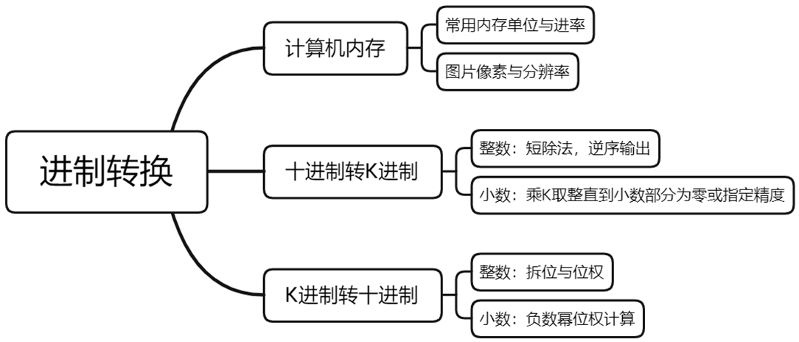
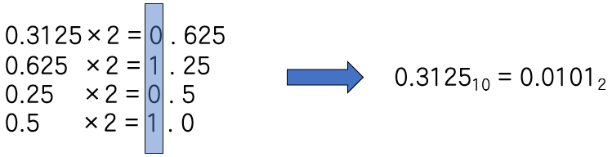
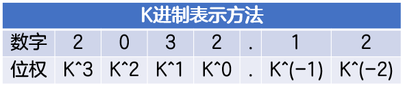

# 进制转换

>我们在之前的学习中已经学习了二进制，除了二进制是否存在其它的进制呢？
>我国古代易经一书中记载，远古时期，人们通过在绳子上打结来记录数量，即“结绳计数”，如图，部落族长在从右到左依次排列的绳子上打结，用来记录部落创立的天数，满七进一，由图可知，部落存在了的天数是 ___。



## 预习篇

### 一、十进制与K进制的转换

在之前的课程中，我们已经学习了通过短除法可以将十进制转化为二进制，具体代码如下：

```c++
while(n > 0){  //直到商为0终止
  a[j] = n % 2;  //对2取余
  n /= 2;  //除以2
  j++;  //方便下一个余数存储
}
for(int i = j - 1; i >= 0; i--)//倒序输出
  cout << a[i];
```
同理，十进制同样可以通过短除法转化为K进制，只需将上述代码中的2改成K即可，具体如下：
```c++
while(n > 0){
  a[j] = n % k;
  n /= k;
  j++;
}
for(int i = j - 1; i >= 0; i--)
  cout << a[i];
```
**练习**

- [ ] [十进制转八进制](https://oj.youdao.com/problem/9329?from=problems)


### 二、K进制与十进制的转换

在之前的学习中，已经掌握了如何将二进制转十进制，拆位和位权是实现的关键，对于二进制整数而言，从低到高第$k$位的位权是$2^{k-1}$，拆出每一位乘上对应位权累加求和即可，代码如下：

```c++
int w = 1;  //二进制数的最末位数字的权重为1，之后依次为前一位权重的2倍
while (n > 0) {
  int tmp = n % 10;  //从末尾取值
  ans = ans + tmp * w;  //该值tmp乘上对应权重增加至结果中
  w *= 2;   //增加下一个数字的权重
  n /= 10;   //抹去当前已处理的数字
}
cout << ans;
```
同理，K进制可以通过上述方式转化为十进制，只需将上述代码中的2改成K即可，具体如下：
```c++
int w = 1;
while (n > 0) {
  int tmp = n % 10;
  ans = ans + tmp * w;
  w *= k;
  n /= 10;
}
cout << ans;
```
**练习**
- [ ] [K进制转十进制](https://oj.youdao.com/problem/12934?from=problems)


## 课后篇



### 一、这节课我学到了什么

### 1.1 计算机内存

#### 常用内存单位

1Byte(字节) = 8 bit(位)

1024Byte(字节) = 1KB(KiloByte千字节)

1024KB(KiloByte千字节) = 1MB(MegaByte兆字节)

1024MB(MegaByte兆字节) = 1GB(GigaByte吉字节)

#### 图片相关属性

像素：是图像中的最小单位。

位深度：存储图片一个像素需要消耗多少位，可能是4位、8位、24位、32位。

分辨率指每英寸图像内有多少个像素点，分辨率的单位为PPI(Pixels Per Inch)，通常叫做像素每英寸。

### 1.2 二进制与四，八，十六进制的转换

四进制包含数字0~3，如果将一位四进制数字用二进制表示，最多需要几位？如果是八进制呢？如说是十六进制呢？通过计算我们可以得出如下结果：

四进制最多需要两位二进制数，0~3对应00~11；

八进制最多需要三位二进制数，0~7对应000~111；

十六进制最多需要四位二进制数，0~9，A~F对应0000~1111。

在遇到上述进制间相互转换的题目时，可以先转化为二进制，再转化为对应进制，例如将四进制数字13210转化为十六进制，具体操作如下：

1.将一位四进制转化为两位二进制，01（1）、11（3）、10（2）、01（1）、00（0），结果为0111100100；

2.从低位到高位，每次将4位二进制转化为1位十六进制，不足4位的右补0，4（0100），E（1110），2（0010），结果为2E4。

### 1.3 十进制转K进制

#### 整数

通过短除法即可实现，倒序输出，代码实现如下

```c++
int n, j = 0;
int a[1000];  //因为最先得到的余数最后输出，所以需要储存
cin >> n;
while(n > 0){  //短除法
  a[j] = n % k;
  n /= k;
  j++;
}
for(int i = j - 1; i >= 0; i--)  //倒序输出
  cout << a[i];
```
#### 小数

与整数部分采用短除法不同，需要将十进制数字小数部分与K相乘，每次相乘后去掉整数部分，不断乘下去，直到小数部分为 0 或达到指定的精度为止，然后取每次相乘后的整数部分即可，例如将十进制的0.3125转化为二进制，过程如图所示



### 1.4 K进制转十进制

#### 整数

对于K进制整数而言，从低到高第$a$位的位权是$$K^{a-1}$$，拆出每一位乘上对应位权累加求和即可转化为十进制，代码如下：

```c++
int n;
cin >> n;
int ans = 0, w = 1;  //K进制数的最末位数字的权重为1，之后依次为前一位权重的K倍
while (n > 0) {
  int tmp = n % 10;  //从末尾取值
  ans = ans + tmp * w;  //该值tmp乘上对应权重增加至结果中
  w *= K;  //增加下一个数字的权重
  n /= 10;  //抹去当前已处理的数字
}
cout << ans;
```
#### 小数

与整数转换类似，小数部分同样需要使用位权，小数点左侧整数位第一位的位权是$K^{0}$，右侧小数位第一位的位权是$K^{-1}$，整体依然满足从左到右从小到大，相邻位权幂数差一，如图所示



图片中K进制数转十进制的计算如下：
$$
\left( 2032.12 \right)_{K} = 2 \times K^{3} + 0 \times K^{2} + 3 \times K^{1} + 2 \times K^{0} + 1 \times K^{-1} + 2 \times K^{-2}
$$
计算整数的负数次幂时，只需将它转化为整数的正数次幂的倒数再计算即可。
$$
K^{-b} = \frac{1}{K^{b}}，例如2^{-3} = \frac{1}{2^{3}} = \frac{1}{8}=0.125
$$


### 二、易错点

#### 2.1 知识易错点

1. 计算图片大小时，位深度的单位是位（bit），而不是字节（Byte）；
2. 十进制转K进制小数的停止条件，当小数部分始终无法为0时，满足精度要求即可停止；例如将十进制的0.1转化为二进制；
3. K进制转十进制小数，当有多位小数时可以先通分求和再化简成分数最简式，再按照精度要求计算小数结果，如果每一位计算时都直接计算小数结果再累加可能会导致结果精度缺失；
#### 2.2 代码易错点

1. 十进制转K进制的时候，短除法求得的余数需要逆序输出；
```c++
for(int i = j - 1; i >= 0; i--)
  cout << a[i];
```
长度为n的数组判断回文时，若从1开始，循环应到$$\frac{n}{2}$$(包含$$\frac{n}{2}$$);

```c++
for(int i=1;i <= top / 2;i++)
  if (a[i] != a[top + 1 - i]){
    cout << "NO";
    return 0;
  }
```
2. K进制转十进制的时候，权重初始为1；
```c++
int w = 1; 
```
3. 通过拆位和打擂台可以确定一个整数中最大的数字；
```c++
int maxnum(int num){
  int maxn = 0;
  while (num != 0){
    if (num % 10 > maxn) maxn = num % 10;
      num /= 10;
  }
  return maxn;
}
```


### 三、课后作业

|题目 * 5|    |
|:----|:----|
|[计算机内存-选择题](https://oj.youdao.com/course/10/111/2#/3/8662)|    |
|[图片内存-选择题](https://oj.youdao.com/course/10/111/2#/3/8663)|    |
|[进制转换-选择题](https://oj.youdao.com/course/10/111/2#/3/8664)|    |
|[阅读程序](https://oj.youdao.com/course/10/111/2#/3/8665)|    |
|[数制转换](https://oj.youdao.com/course/10/111/2#/1/9253)|    |

- [ ] 都完成啦！😀😀😀

  
### 四、真题重现

#### 4.1  数列  [2006普及组]

**题目描述**

给定一个正整数k（3≤k≤15），把所有k的方幂及所有有限个互不相等的k的方幂之和构成一个递增的序列，例如，当k=3时，这个序列是：

1，3，4，9，10，12，13，...

（该序列实际上就是：30，31，30+31，32，30+32，31+32，30+31+32，...）

请你求出这个序列的第N项的值（用10进制数表示）。

例如，对于k=3，N=100，正确答案应该是981。

**输入格式**

每组输入数据只有1行，包含2个正整数k和N，用一个空格隔开（k、N的含义与上述的问题描述一致，且3≤k≤15，10≤N≤1000）。

**输出格式**

每组输出为计算结果，是一个正整数（在所有的测试数据中，结果均不超过2.1*109，整数前不要有空格和其他符号）。

**样例输入**

```plain
3 100
```
**样例输出**

```plain
981
```
- [ ] [数列](https://oj.youdao.com/problem/237?from=problems)


### 五、挑战题目

|题目|    |
|:----|:----|
|[神奇的核粒子](https://oj.youdao.com/problem/5461?from=problems)|    |
|[小图灵数字](https://oj.youdao.com/course/17/240/1#/1/12935)|    |
|[巴啦啦小图灵任意进制！变！](https://oj.youdao.com/course/17/240/1#/1/12937)|    |

- [ ]  挑战题也都完成啦！强的如同👽！
