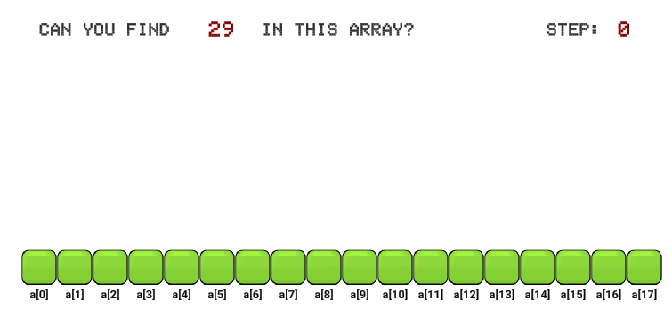

## 电子讲义

#### Unit1 众里寻他千百度:   [顺序查找](https://ayuki1024.github.io/L2_ebook/L2%E7%AC%AC1%E8%AF%BE%E9%A1%BA%E5%BA%8F%E6%9F%A5%E6%89%BE/%E9%A1%BA%E5%BA%8F%E6%9F%A5%E6%89%BE.html)

#### 顺序查找 [传送门](https://ayuki1024.github.io/edu_game/shunxuchazhao/)

#### Unit2 先来后到讲规矩:   [栈与队列](https://ayuki1024.github.io/L2_ebook/L2%E7%AC%AC2%E8%AF%BE%E6%A0%88%E5%92%8C%E9%98%9F%E5%88%97/%E6%A0%88%E5%92%8C%E9%98%9F%E5%88%97.html)

#### Unit3 关于数位的奥秘:   [数位拆分]

#### Unit4 实战演练出真知   

#### Unit5 初识0与1的世界:   [二进制]

#### Unit6 一个萝卜一个坑:   [计数排序](https://ayuki1024.github.io/L2_ebook/L2%E7%AC%AC7%E8%AF%BE1%E4%B8%AA%E8%90%9D%E5%8D%9C1%E4%B8%AA%E5%9D%91/%E4%B8%80%E4%B8%AA%E8%90%9D%E5%8D%9C%E4%B8%80%E4%B8%AA%E5%9D%91.html)

#### Unit7 筛法求素数:           [筛法]

#### Unit8 实战演练出真知

...

## 游戏

#### 计数排序_水果 [传送门](https://ayuki1024.github.io/edu_game/cntSortFruit)

#### 计数排序_数字 [传送门](https://ayuki1024.github.io/edu_game/cntSortNumber)

