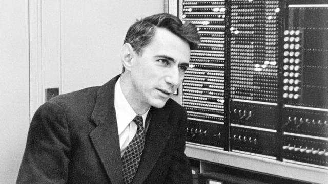

# GESP一级直通车

> 一篇梳理GESP编程能力等级考试一级C++语言全部知识架构，掌握重点，吃透难点，摆平易错点。

你需要预先知道的：

## GESP一级考什么？

1. [计算机基础与计算机历史](#一、计算机基础与编程)
2. [变量的定义与输入，输出语句](#二、变量定义与输入输出语句)
3. [基本数据类型（整型、浮点型、字符型、布尔型）](#三、基本数据类型（整型、浮点型、字符型、布尔型）)
4. [控制语句结构（顺序、循环、选择）](#四、控制语句结构（顺序、循环、选择）)
5. [基本运算（算数运算、关系运算、逻辑运算）](#五、基本运算（算数运算、关系运算、逻辑运算）)

## GESP一级题型有哪些？

15个单选题，10个判断题，每题2分，共50分。

2个编程题，每题25分，共50分。

## 如何高效备考？

插入一张表格


## 一、计算机基础与编程

> 这部分内容考察的范围广应用浅，属于了解知道即可。
>
> 复习时不必死记硬背，多读几遍就行。


### 1.1 计算机的分类 

- 按年代分类

  

- 按性能分类

  巨型机>大/中型机>小型机>微型机=工作站。

  一般按照规模大小、性能、能耗等分类。

  - 巨型机（超级计算机，简称「超算」）：**速度极快，容量极高，体积极大**。高速度，大容量，因而能够承担重大的科学研究，用于**计算地震/太空/天气预报**等复杂用途，我国的有：银河/天河等。

  巨型机运算速度平均每秒千万次以上，存储容量千万位以上。

  - 大/中型机：**速度快，容量极高，体积大**。高可靠性，可用性，服务型，主要用于**顶尖科研领域**。

  大型机和超级计算机（旧称巨型机）的主要区别:

  1. 大型机使用专用指令系统和操作系统，巨型机使用通用处理器及 UNIX 或类 UNIX 操作系统（如 Linux）。
  2. 大型机长于非数值计算（数据处理），巨型长于数值计算（科学计算）。
  3. 大型机主要用于商业领域，如银行和电信，而巨型用于尖端科学领域，特别是国防领域。
  4. 大型机大量使用冗余等技术确保其安全性及稳定性，所以内部结构通常有两套。而巨型机使用大量处理器，通常由多个机柜组成。
  5. 为了确保兼容性，大型机的部分技术较为保守。

  - 小型机：**速度快，容量高，体积中**。主要用于**单位服务器/其他领域**。

  小型机采用精简指令集处理器，性能和价格介于PC服务器和大型主机之间的一种高性能 6464 位计算机。

  小型机主要用于金融证券和交通等对业务的单点运行具有高可靠性的行业应用。

  - 微型机：**速度快，容量中，体积小**。主要用于**个人工作/处理数据，2020 世纪 7070 年代后非常普及（电脑大部分都是微型机）**。各位同学面前的电脑、笔记本、手机等等基本上都是微型机。
  - 工作站：**速度快，容量中，体积小**。用于**辅助微型机工作**。

### 1.2 重要计算机科学家


- 阿兰·艾伦·图灵（英）：数学家，逻辑学家，计算机科学/人工智能之父，**首次提出了计算机科学理论**。计算机界的最高奖项“图灵奖”以他命名，被称为“计算机界的诺贝尔奖”。


- 冯·诺依曼（美）：科学家，现代计算机之父，**首次提出了存储程序控制原理**，称为“冯·诺依曼结构”。

  

  

- 克劳德·香农（美）：科学家，创造了信息论，**提出了某种信息从一处传送到另一处所需的全部设备所构成的系统**。

  

### 1.3 计算机的构成 

要想实现计算机的基础功能，计算机必须由**运算器、存储器、控制器、输入设备、输出设备**构成，缺少前两者就无法正常启动计算机，即为“冯·诺依曼结构”。

- CPU（Central Processing Unit）：中央处理器，由**运算器（计算）+控制器（指挥）+寄存器**组成。

**计算机的核心部件**，被称为计算机的“大脑”，又称“微处理器”。

- 内存储器：简称“内存”，用于**电脑内部**的存储。相对外存而言，**读写速度快，但是存储空间小**，并且存储在 RAM 里的数据**断电后会丢失**。注意与“外存（硬盘等）”区分开。
- RAM（Random Access Memory）：随机存取存储器，与CPU直接交互数据，可随时读写，**断电数据全部丢失**。
- ROM（Read-Only Memory）：只读存储器，只能读出无法写入信息。信息一旦写入后就固定下来，**断电数据不会丢失**，故又称为固定存储器。
- 外存储器：简称“外存”，用于处置长期保存的数据，一般**处于电脑外部**，**断电后数据不会丢失**。相对内存而言，外存**读写速度慢，但存储容量大**。主要包括硬盘、光盘、U 盘（USB闪存盘）等类型。
- 输入设备：在计算机与人交互时，**接受外部命令或者需要加工的数据**。常用的输入数据包括键盘、鼠标、麦克风、摄像头等。
- 输出设备：在计算机与人交互时，**将处理结果以人类能够识别/感受的方式呈现出来**的设备。常有的输出设备包括显示器、音响、打印机等。

- 访问速度：寄存器>高速缓存>内存>外存。
- 断电后数据保留于 ROM 和外存。

### 1.4 计算机语言常识 

- 机器语言/机器码：最早的语言，**计算机能识别的语言**，**由二进制数字 0/10/1 组成**，速度快，人类编码难度高，一般由计算机自动转换。
- 汇编语言：用符号代替二进制数，**计算机不能直接识别**，需要用编译器进行编译，难度依然很大，目前除了对性能要求极高的需求以外不被使用。
- 高级语言：如今的编程语言（C++，JAVA 等），需要用编译器，难度小，分为编译方式和解释方式两种编译方式。
  - 编译方式（C++）：先对整个程序进行编译（会进行多次分析），再执行程序。速度快（进行多次编译对程序进行优化）。
  - 解释方式（Python/PHP）：扫描一行解释一行，速度慢（无法进行优化）。

### 1.5 真题举一反三

单选题：

1.以下奖项与计算机领域最相关的是（）。

 A. 奥斯卡奖  

B. 图灵奖  

C. 诺贝尔奖  

D. 普利策奖


【解析】：

图灵奖（Turing Award），是由美国计算机协会（ACM）于1966年设立的计算机奖项，名称取自阿兰·图灵（Alan M. Turing），旨在奖励对计算机事业作出重要贡献的个人。图灵奖一般每年仅授予一名计算机科学家。图灵奖是计算机领域的国际最高奖项，被誉为“计算机界的诺贝尔奖”。

从1966年至2021年，图灵奖共授予75名获奖者，以美国、欧洲科学家为主。2000年，华人科学家姚期智获图灵奖，是华人第一次也是唯一一次获得图灵奖。

正确选项B。


2.提出“存储程序”的计算机工作原理的是（）。 

A. 冯·诺依曼  

B. 克劳德·香农  

C. 戈登·摩尔  

D. 查尔斯·巴比奇


【解析】：

- 冯·诺依曼

美籍匈牙利数学家：冯.诺依曼提出了计算机“存储程序”的计算机设计理念，即将计算机指令进行编码后存储在计算机的存储器中，需要的时候可以顺序地执行程序代码，从而控制计算机运行。

早期的计算机设计中，程序和数据是俩个截然不同的概念，数据放在存储器中，而程序作为控制器的一部分，这样的计算机计算效率低，灵活性较差。冯.诺依曼结构中，将程序和数据一样看待，将程序编码为数据，然后与数据一同存放在存储器中，这样计算机就可以调用存储器中的程序来处理数据了。意味着，无论什么程序，最终都是会转换为数据的形式存储在存储器中，要执行相应的程序只需要从存储器中依次取出指令、执行。这种设计思想导致了硬件和软件的分离，即硬件设计和程序设计可以分开执行。

- 克劳德·香农

克劳德·香农是美国数学家，密码学家。1948年，他发表了划时代的论文——《通讯的数学理论》，奠定了现代信息论的基础。 还被认为是数字计算机理论和数字电路设计理论的创始人。

- 戈登·摩尔

戈登·摩尔是英特尔的创始人之一，他将自己的经验总结为“摩尔定律”，其核心内容为：集成电路上可以容纳的晶体管数目在大约每经过18个月到24个月便会增加一倍。换言之，处理器的性能大约每两年翻一倍，同时价格下降为之前的一半。

- 查尔斯·巴比奇

查尔斯·巴贝奇，19世纪英国数学家、发明家兼机械工程师。由于提出了差分机与分析机的设计概念（并有部份实做机器），被视为计算机先驱。

正确选项A。


3.以下不是存储设备的是（）。

 A. 光盘 

B. 磁盘 

C. 固态硬盘 

D. 鼠标


【解析】：

存储设备是用于储存信息的设备或装置。通常是将信息数字化后再以利用电、磁或光学等方式的媒体加以储存。

常见的储存设备有：

利用电能方式储存信息的装置如：各式随机存取存储器（RAM）、只读存储器（ROM）、固态硬盘（SSD）等
利用光学方式储存信息的装置如：CD、DVD、Blu-ray
利用其他实体物如纸卡、纸带等储存信息的装置如：打孔卡、打孔带等

正确选项D。


4.以下不属于操作系统的是（）。 

A. Windows  

B. photoshop 

C. Linux 

D. Mac OS


【解析】：

操作系统（Operating System）是一组用来控制计算机运行、调度软件资源的软件程序，是计算机系统的核心与基石。

操作系统需要

​	-管理与配置内存

​	-决定系统资源供需的优先次序

​	-控制输入与输出装置

​	-操作网络与管理文件系统等等。

操作系统也提供一个让使用者与系统互动的操作界面。常见的操作系统有Unix，Linux，Mac OS，windows。

正确选项B。


5.下列不属于面向对象编程语言的是（ ） 

A. C  

B. C++ 

C. JAVA 

D. Python


【解析】：

面向对象程式设计（Object-oriented programming）是一种程式开发的抽象方针。对象指的是类别（class）的实例。比如小黑是只哈士奇，哈士奇是类，小黑是哈士奇类的实例，即对象。

常见的面向对象编程语言包括 Python、C++、Java、Swift、C#、Ruby、JavaScript 与 PHP等。

特别需要注意的是 C语言是面向过程的编程语言。

正确选项A。


判断题

1.第一台现代电子计算机是 ENIGMA。


【解析】：

非常容易做错的题目。

ENIGMA是一种用于加密与解密文件的密码机。它是二战时期纳粹德国使用的一系列相似的转子机械加解密机器的统称。

ENIAC才是世界上第一台计算机的名字。它于1946年2月14日在美国宾夕法尼亚大学诞生。发明人是美国人莫克利（JohnW.Mauchly）和艾克特（J.PresperEckert）。它是一个庞然大物，用了18000个电子管，占地170平方米，重达30吨，耗电功率约150千瓦，每秒钟可进行5000次运算。 ENIAC以电子管作为元器件，所以又被称为电子管计算机，是计算机的第一代。美国国防部用它来进行弹道计算。


错误。


2.只要计算机不连接互联网，就不可能感染计算机病毒。


【解析】：

计算机病毒主要传播途径有以下四种：

​	①通过软盘等存储介质传播

​	②通过游戏软件传播

​	③通过网络传播

​	④通过计算机硬件传播

所以不联网也有可能感染计算机病毒。

错误。


3.C++程序中必须要有 main 函数。


【解析】：

main() 函数是 C++ 程序的入口函数，C++ 标准规定 main() 函数的返回值类型为 int，返回值用于表示程序的退出状态，返回 0 表示程序正常退出，返回非 0，表示出现异常。

正确。


## 二、变量定义与输入输出语句

### 2.1 变量名命名规则

1.不能用数字开头 （起名的时候，可以叫张三，李四，但基本没有叫三张，四李，变量可以是a3, b4, 但别是3a, 4b）

2.不能有除了_之外的其他字符 

3.不能使用系统保留字 

```
//变量的定义，以整型变量为例
int a;
```


### 2.2 C++程序基本框架

C++输入，输出语句有很多，C风格的`printf`和`scanf`在头文件<cstdio>中，C++风格的`cout`和`cin`在<iostream>中。

```C++
#include <cstdio>

int main() {
	
    


	return 0;
}
```


### 2.3 真题举一反三

单选题

1.不可以作为 C++标识符的是（） 

A. Printf  

B. _123 

C. While 

D. case


判断题

1.常量是在整个程序运行过程中不能改变的量。


## 三、基本数据类型（整型、浮点型、字符型、布尔型）


| 类型名称     |        | 占位符                    | 可以保存的数值范围 |      |
| ------------ | ------ | ------------------------- | ------------------ | ---- |
| 32位整型     | int    | %d                        |                    |      |
| 单精度浮点型 | float  | %f                        |                    |      |
| 双精度浮点型 | double | %lf                       |                    |      |
| 字符型       | char   | 输入时%c，输出时%c %d都行 |                    |      |
| 布尔型       | bool   | NA                        |                    |      |

### 真题举一反三

1.常量 3.14 的数据类型是（） 

A. double  

B. float  

C. void  

D. int


2."A"是一个字符常量。


## 四、控制语句（顺序、选择、循环）

顺序执行就像跑步喊口号

1 ~ 2~ 3~ 4~

选择分支

```
if (a > 5) {
	
} else {
	
}
```

多个分支

```
if (a > 5) {

} else if (a > 3) {
	
} else if (a > 1) {

} else {

}
```


while 循环

```
// 1 定义循环变量
int i = 1;
// 2 确定循环条件
while (i <= 10) {
	// 3 循环里做一些操作
	// 4 更新循环变量
	i++;
}
```


for 循环

```
// 从数字1 打印到 数字10
for (int i = 1; i <= 10; i++) {
	printf("%d ", i);
}
```


### 真题举一反三

判断题

1.下列代码会输出 50 个 1。

```
for (int i = 1; i <= 100; i *= 2) {
 cout << 1;
}
```


2.在 if…else 语句中，配对规则是 else 总是与最近的未配对的 if 配对。


3.在 while 语句中，while 后的()中的表达式只能是逻辑或者关系表达式。


4.for 语句的语法为：for (表达式 1; 表达式 2; 表达式 3) 语句。其中的三个 表达式均可以为空。


5.C++中，while 和 do…while 语句的功能完全相同。


## 五、基本运算（算数运算、关系运算、逻辑运算）

算术运算：加，减，乘，除，取模

关系运算：大于，小于，等于，大于等于，小于等于，不等于

！陷阱 等于和赋值


逻辑运算符：与，或，非


### 真题举一反三


1.如果 x 和 y 均为 int 类型的变量，且 x 的值为 1、y 的值为 2，则下列哪个表 达式的结果为 true？ 

A. (x + y > 7) && (x - y < 1) 

B. !(x + y) 

C. (x > y - 1) || x 

D. x && (!y)


2.如果输入数据为 99 和 100，下列代码的输出结果为（）。

```C++
#include<iostream>
using namespace std;
int main() {
    int a, b;
    cin >> a >> b;
    a = a + b;
    b = a - b;
    a = a - b;
    cout << a << " " << b << endl;
return 0;
}

```

A. 99 100 

B. 99 99 

C. 100 100 

D. 100 99


3.如果 a 为 int 类型的变量，且 a 的值为奇数，则下列哪个表达式的结果一定 为 false？ 

A. a % 2 == 1  

B. !(a % 2 == 0)  

C. !(a % 2)  

D. a % 2 


4.下列表达式能够正确判断“a 不等于 0 且 b 不等于 0”的是（） 

A. !a == 0 || !b == 0 

B. !((a == 0) && (b == 0)) 

C. !(a == 0 && b == 0) 

D. a && b


5.若 a、b、c、d 均为 int 类型的变量，并且初值均为 0，以下不是正确的赋 值语句是（）。 

A. a = b = c = d = 100; 

B. d++; 

C. c + b; 

D. d = (c = 22) - (b++);


6.A、B、C 是三个 int 类型的变量，如果已知表达式(A >= B && B >= C)的结 果为 true，则表达式(A > C || B == C)的结果（）。

 A. 为 true 

B. 为 false 

C. 无法判定结果 

D. 当 A、B、C 都相等时为 true，否则为 false


## 考场小贴士：

1.提前一天准备好准考证，身份证，铅笔，橡皮，签字笔收到一个小袋中，随走随拿。

2.

3.

4.

5.

6.

