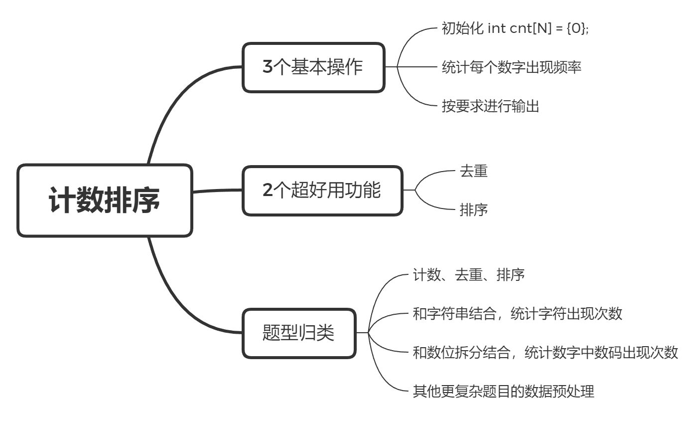

# 一个萝卜一个坑：计数排序

> 计数数组是计数器变量的“升级版本”，它通过巧妙运用数组下标来完成计数工作。

## 预习篇

### 1. 计数器变量的使用

- 给定100个小于100的正整数，
  1. 如何统计其中数字7出现的次数？
  2. 如何统计其中数字3、5、7出现的次数？
  3. 如何统计其中数字1到100出现的次数？

显然学过循环的我们知道，可以通过定义一个计数器变量来解决第一个问题：

```c++
int cnt = 0;
for (int i = 0; i < 100; i++) {
	int t;
	scanf("%d", &t);
	if (t == 7) cnt++;
}
printf("%d", cnt);
```

对于问题2，统计的数字个数变为了3个，你一定知道要怎么做~

```c++
// 这时候只要将计数器变量从1个变为3个就好啦~
int cnt3 = 0, cnt5 = 0, cnt7 = 0;
for (int i = 0; i < 100; i++) {
	int t;
	scanf("%d", &t);
	if (t == 3) cnt3++;
	if (t == 5) cnt5++;
	if (t == 7) cnt7++;
}
printf("%d %d %d", cnt3, cnt5, cnt7);
```
巩固计数器的练习：

- [ ] [奥运奖牌计数](https://oj.youdao.com/problem/9181?from=problems)

不过，当问题再次升级，需要统计数字1到100，每一个数字出现的次数时，按照上面的思路，难道要定义100个变量？这...😅😅😅，确实听起来就不是什么好主意。

回忆一下最开始学习数组，也是因为要保存的数据元素较多，和现在的情形类似。

## 课后篇



### 一、咚咚~计数数组横空出世

计数数组可以看为是对计数器变量的一个升级🆙，也是对数组下标的灵活运用。下面先来回答预习篇最后1个问题（当然相信你心里早已有了答案~）。


观察有了计数数组前后代码的变化

```c++
int cnt1 = 0, cnt2 = 0, cnt3= 0, ......, cnt100 = 0;
int cnt[105] = {0};
```

尝试处理预习篇提出的最后1个问题：

```//
int cnt[105] = {0};
for (int i = 0; i < 100; i++) {
	int t;
	scanf("%d", &t);
	cnt[t]++; 
}
// 下面输出每个数字出现的次数

for (int i = 1; i <= 100; i++) {
	printf("数字%d出现的次数是%d\n", i, cnt[i]);
}
```

### 二、计数数组的基本操作


#### 2.1 一个萝卜一个坑 [模板题]

地上有 10 个坑，分别编号为 0~9，现在，小图灵有 5 粒萝卜种子，他从这 10 个坑中选出了其中的 5个（可重复选择）种上了萝卜种子，请你编写程序，帮小图灵找出哪些坑不会长出萝卜？


##### 输入描述

输入 5 个数，表示小图灵会在这 5 个坑里种上萝卜种子。

##### 输出描述

输出那些没有种萝卜的坑的编号。按从小到大输出。

##### 输入样例

2 4 8 9 2

##### 输出样例

0 1 3 5 6 7

- [ ] ##### 快来试试补完程序


```c++
//尝试填空
#include <iostream>
using namespace std;

int main() {
    int cnt[?] = {?};
    for (int i = 0; i < ?; i++) {
        int t;
        scanf("%d", &t);
        cnt[?]++;
    }
    for (int i = ?; i <= ?; i++) {
        if (?) {
            printf("%d ", ?);
        }
    }
    
}
```


#### 2.2⭐3步秒懂计数数组

##### 👣Step **One**  

初始化计数数组，这一步的关键是计数数组的长度，想一想如果需要统计的是10000个数字，每个数字出现的次数，数字取值的范围是0到100。

是选

A int cnt[10005] = {0};

还是

B int cnt[105] = {0};

答案是B.

这一步执行后，计数数组cnt会变成这样：


##### 👣Step **Two**

```c++
for (int i = 0; i < n; i++) {
	int t;
	scanf("%d", &t);
	cnt[t]++;
}
```

在循环中进行统计，统计每个数字出现的频率，一定要理解循环中cnt[t] 表示的是什么。

这步之后计数数组会变成：


##### 👣Step **Three**

根据题目要求，对计数数组的值进行相应的操作。比如最简单的打印，要求出现过的数字：

```c++
for (int i = 0; i <= maxn; i++) {
	if (cnt[i]) printf("%d ", i);
}
```


第三步实际上就是进行扫描。

#### 2.3 用计数数组做排序

> 排序是将一组“无序”的数据元素调整为“有序”的计算机内操作过程。
>
> 生活中排序十分常见，学校的课间操时间，每个班级的同学都会按照高矮个在操场列队。期末考试成绩出来了，老师会按照比分排序，以表扬那些学的好，督促那些还需要进一步努力的同学。

##### 2.3.1身高游戏


先试着写入你家人的身高，比如爸爸、妈妈、爷爷、奶奶和你的身高。

写完后从一边往另一边念，哇，神奇的事情发生了，念出来的数字有序了！刚刚我们做到的就是使用计数数组进行排序。

##### 2.3.2 例题

小图灵大学正在选举新一届学生会，共有 n 名候选人，编号从 1 到 n，最终收集到 m 张选票，每张选票上都写着一个合法的编号。现在请你将所有选票按照候选人编号从小到大进行排序。


###### 输入描述

第一行两个整数 n和 m，第二行 m 个整数。

###### 输出描述

一行，m个整数，为排序后选票上的数字。

###### 输入样例

5

13 17 14 16 12

###### 输出样例

12 13 14 16 17

- [ ] ##### 补充填写这份代码中的???部分：

```C++
#include <iostream>
using namespace std;

int main() {
    int n, m, cnt[???] = {0};
    cin >> n >> m;
    for (int i = 0; i < ???; i++) {
        int t;
        cin >> t;
        cnt[???]++;
    }
    for (int i = 1; i <= n; i++) {
        while (cnt[i]) {
            printf("%d ", i);
            cnt[???]--;
        }
    }
    return 0;
}
```

#### 

#### 2.4 课后作业

2.4.1 下面的说法对吗？

1.给定100000个数值范围在0到20000之间的数字，帮助统计每个数字出现次数，计数数组的长度需要开到100005。

2.计数数组不能统计负数和小数出现的频率。

| 2.4.2 编写程序题目                                           |      |
| :----------------------------------------------------------- | ---: |
| [阅读题目写输出](https://oj.youdao.com/course/10/98/2#/3/8650) |      |
| [找字符串中最后一个只出现一次的字符](https://oj.youdao.com/course/10/98/2#/1/8167) |      |

- [ ] 我都完成啦~计数小天才就是我啊！

#### 2.5 更多的练习

| 题目                                                         | 提交情况 |
| :----------------------------------------------------------- | -------: |
| [人口增长问题](https://oj.youdao.com/problem/9157?from=problems) |       NA |
| [矩阵叫换行](https://oj.youdao.com/problem/9062?from=problems) |       NA |
| [计算矩阵元素边缘之和](https://oj.youdao.com/problem/9054?from=problems) |       NA |

#### 2.6 真题重现

##### 2.6.1  明明的随机数  [2006普及组]

###### 题目描述

明明想在学校中请一些同学一起做一项问卷调查，为了实验的客观性，他先用计算机生成了 N 个 1 到 1000 之间的随机整数 N <= 100，对于其中重复的数字，只保留一个，把其余相同的数去掉，不同的数对应着不同的学生的学号。然后再把这些数从小到大排序，按照排好的顺序去找同学做调查。请你协助明明完成“去重”与“排序”的工作。

###### 输入格式

输入有两行，第 1 行为 1 个正整数，表示所生成的随机数的个数 N。

第 2 行有 N 个用空格隔开的正整数，为所产生的随机数。

###### 输出格式

输出也是两行，第 1 行为 1 个正整数 M，表示不相同的随机数的个数。

第 2 行为 M 个用空格隔开的正整数，为从小到大排好序的不相同的随机数。

###### 样例输入 

```
10
20 40 32 67 40 20 89 300 400 15
```

###### 样例输出 

```
8
15 20 32 40 67 89 300 400
```

- [ ] 快去挑战一下！[明明的随机数](https://oj.youdao.com/course/10/98/2#/1/8166)

## 挑战篇

### 一、计数排序的复杂度分析

计数排序不是基于比较的排序算法，算法中的循环时间代价都是线性的，还有一个常数k，因此时间复杂度是Θ(n+k)。

### 二、真题复现 直播获奖  [2020普及组 ]

##### 题目描述

NOI2130 即将举行。为了增加观赏性，CCF 决定逐一评出每个选手的成绩，并直播即时的获奖分数线。本次竞赛的获奖率为 w%，即当前排名前 w% 的选手的最低成绩就是即时的分数线。

更具体地，若当前已评出了 p 个选手的成绩，则当前计划获奖人数为 $\max(1, \lfloor p * w \%\rfloor)$，其中 w 是获奖百分比，$\lfloor x \rfloor$ 表示对 x 向下取整，$\max(x,y)$ 表示 x 和 y 中较大的数。如有选手成绩相同，则所有成绩并列的选手都能获奖，因此实际获奖人数可能比计划中多。

作为评测组的技术人员，请你帮 CCF 写一个直播程序。

##### 输入格式

第一行有两个整数 n, w。分别代表选手总数与获奖率。  
第二行有 n 个整数，依次代表逐一评出的选手成绩。

##### 输出格式

只有一行，包含 n 个非负整数，依次代表选手成绩逐一评出后，即时的获奖分数线。相邻两个整数间用一个空格分隔。

##### 样例 #1

##### 样例输入 

```
10 60
200 300 400 500 600 600 0 300 200 100
```

##### 样例输出 

```
200 300 400 400 400 500 400 400 300 30
```

##### 提示

##### 样例 1 解释


---
##### 数据规模与约定

各测试点的 n 如下表：

| 测试点编号 |  n=  |
| :--------: | :--: |
|   1 ~ 3    |  10  |
|   4 ~ 6    | 500  |
|   7 ~ 10   | 2000 |
|  11 ~ 17   | 10^4 |
|   18~ 20   | 10^5 |


对于所有测试点，每个选手的成绩均为不超过 600 的非负整数，获奖百分比 w 是一个正整数且 1 < w < 99。

---
##### 提示

在计算计划获奖人数时，如用浮点类型的变量（如 C/C++ 中的 `float` 、 `double`）存储获奖比例 w%，则向下取整后的结果不确定。因此，建议仅使用整型变量，以计算出准确值。

- [ ] 快来挑战！[直播获奖](https://oj.youdao.com/problem/7164?from=problems)

### 三、更多的挑战题目

| 题目                                                         |      |
| :----------------------------------------------------------- | ---: |
| [出书最多](https://oj.youdao.com/course/17/241/1#/1/13085)   |      |
| [古代密码](https://oj.youdao.com/course/17/241/1#/1/13086)   |      |
| [整理算式](https://oj.youdao.com/course/17/241/1#/1/13083)   |      |
| [孤单的字母](https://oj.youdao.com/course/17/241/1#/1/13084) |      |
| [垂直直方图](https://oj.youdao.com/problem/9256?from=problems) |      |

- [ ] 我完成啦！
